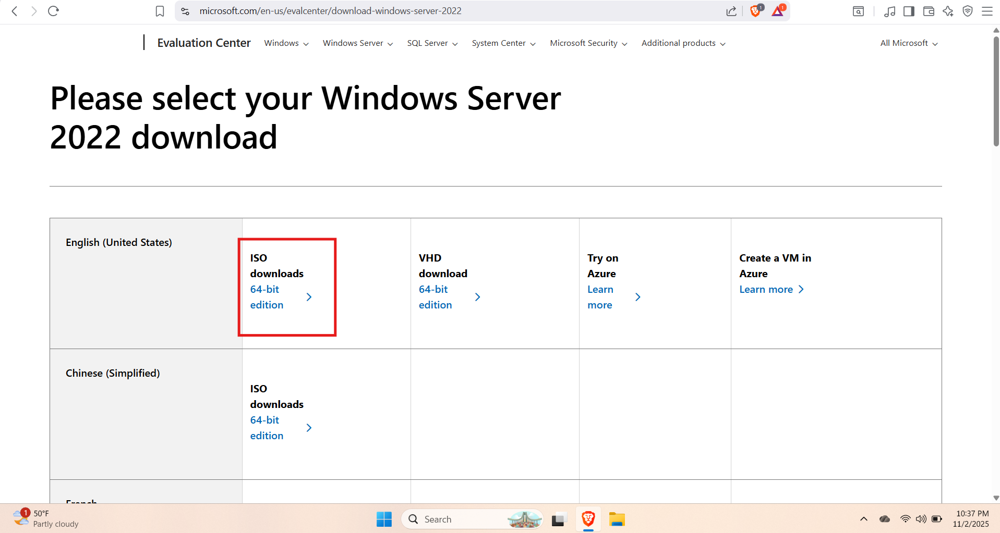
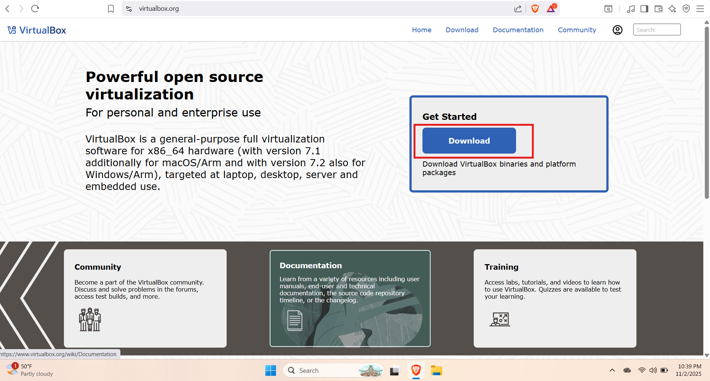
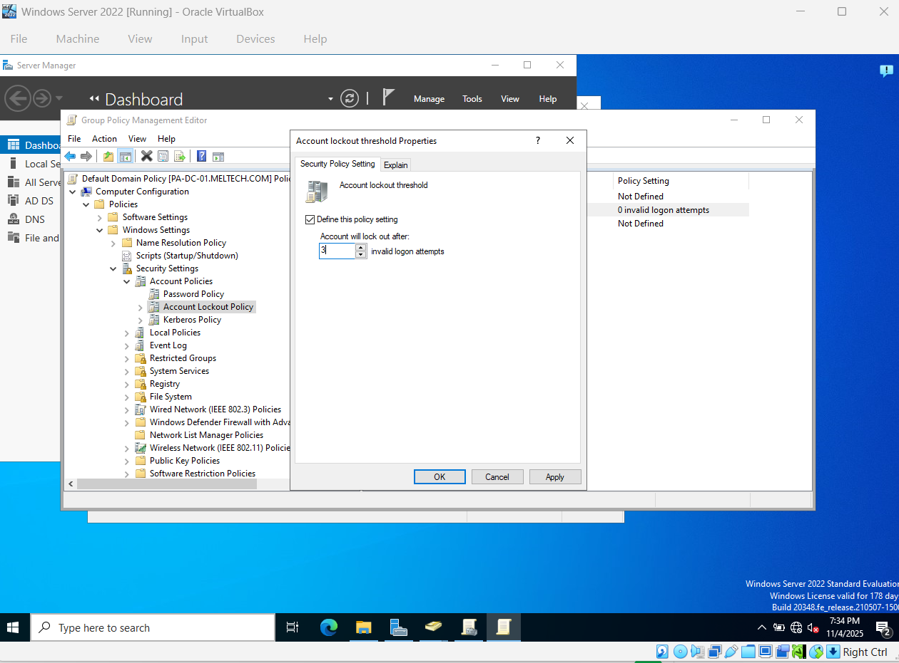
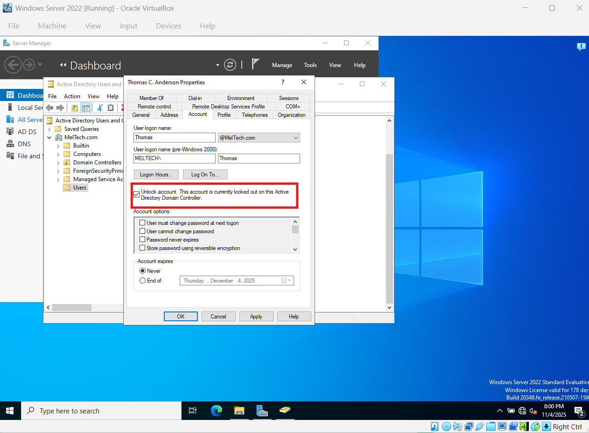

# Active Directory Home Lab Project

This project is my personal IT home lab, gaining hands-on experience with **Windows Server 2022** and **Active Directory** using **Oracle VirtualBox** to simulate a small business environment.

---

## Table of Contents
- [Tools & Environment](#tools--environment)  
- [Objectives](#objectives)  
- [Step 1: Installing ISOs](#step-1-installing-the-isos)  
- [Step 2: Configuring Active Directory](#step-2-configuring-active-directory)  
- [Step 3: Installing Guest Additions and Users](#step-3-installing-guest-additions-and-users)  
- [Step 4: Network Configuration](#step-4-network-configuration)  
- [Step 5: User Management & Security Policies](#step-5-user-management--security-policies)  
- [Step 6: Using Action1](#step-6-using-action1)  
- [Lessons Learned](#lessons-learned)  
- [Certifications](#certifications)  

---

## Tools & Environment
- **Windows 11 ISO** – Client machine  
- **Windows Server 2022 ISO** – Domain Controller  
- **Oracle VirtualBox** – Virtual machine manager  

## Objectives
- Build an **Active Directory Domain**  
- Manage **users and groups**  
- Apply **Group Policies**  
- Configure **DNS and DHCP services**  

> **Note:** This is ongoing; more steps and screenshots will be added.

---

## Step 1: Installing the ISOs
Created two VMs in VirtualBox: Server (`Windows Server 2022`) and Client (`Windows 11`).  

**Screenshots:**  
  
  
  

---

## Step 2: Configuring Active Directory
Installed **AD DS** on the server and promoted it to **Domain Controller**.  
- Created forest & domain: `MelTech.com`  
- Rebooted to apply changes  

**Screenshots:**  
  
  
  
  

---

## Step 3: Installing Guest Additions and Users
Installed **VirtualBox Guest Additions** and created AD users:  
- Thomas C Anderson  
- Melvin L Williams  

**Screenshots:**  
  
  
  

---

## Step 4: Network Configuration
- Static IPs: Server `10.1.10.2`, Client `10.1.10.3`  
- Joined Windows 11 client to `MelTech.com` domain  
- Verified in Active Directory (`Desktop01` under Computers)  
- Enabled Remote Desktop  

**Screenshots:**  
  
  
  
  
  
  
  

---

## Step 5: User Management & Security Policies
- Reset, activate, disable, delete accounts  
- Login hours: Thomas C Anderson Mon–Fri 6am–6pm  
- Group Policy:  
  - Max password age: 90 days  
  - Lockout threshold: 3 failed attempts  
  - Lockout duration: 360 min  
- Verified by testing failed logins, then unlocked  

**Screenshots:**  
  
  
  
  
  
  
  

---

## Step 6: Using Action1
- Installed **Action1**  
- Deployed 5 updates  
- Ran vulnerability remediation  

**Screenshots:**  
  
  

---

## Lessons Learned
- Active Directory setup & domain management  
- Group Policy & security enforcement  
- Network configuration & client-domain connectivity  
- Patch management & vulnerability remediation  

---

## Certifications
- CompTIA Security+  
- Microsoft Azure Fundamentals (AZ-900)  
- Currently studying for: Cisco CCNA
