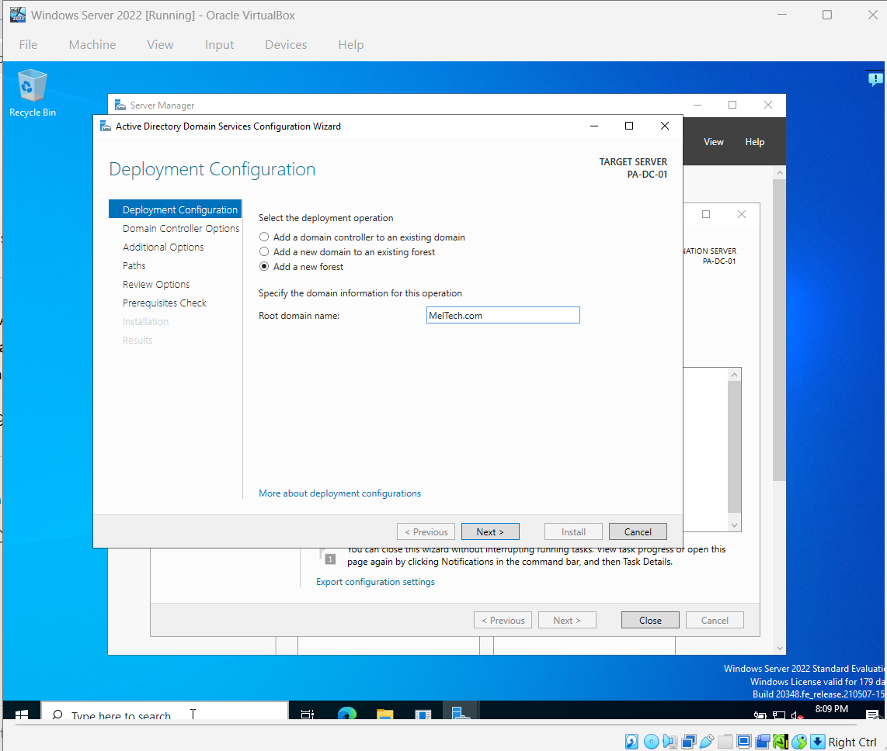
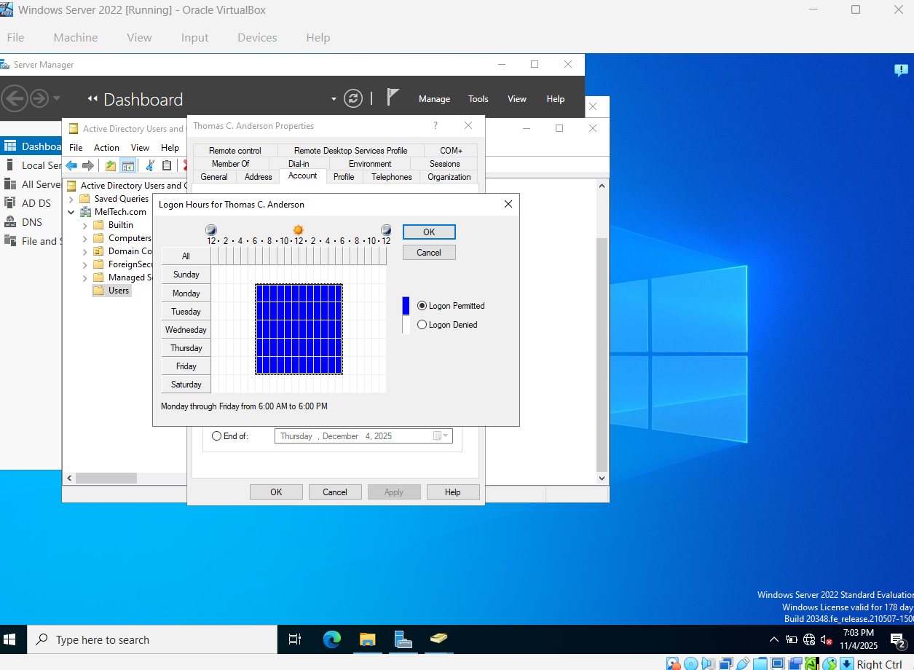
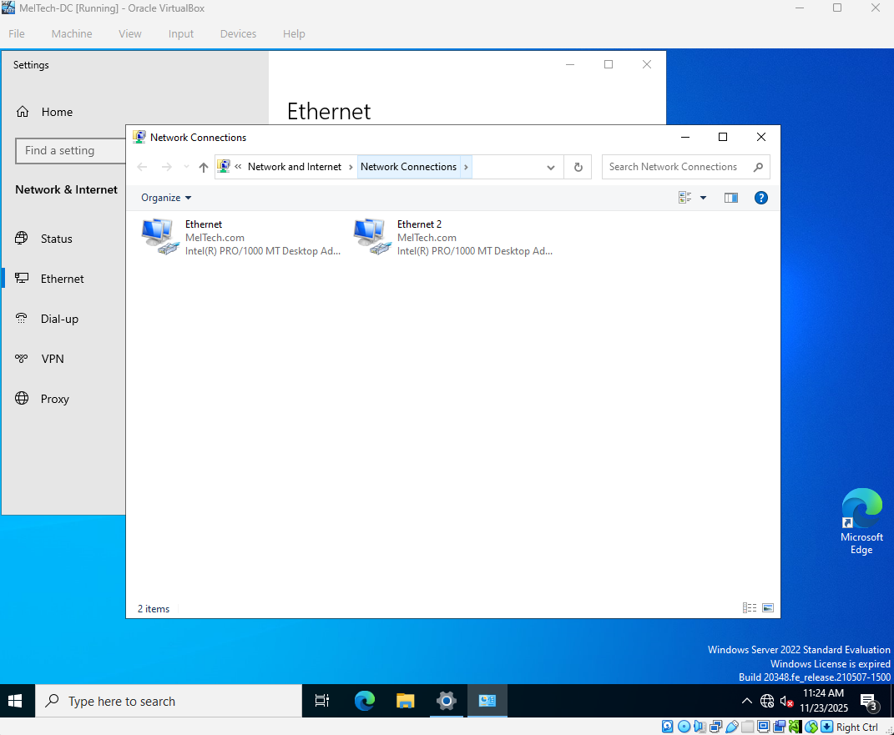
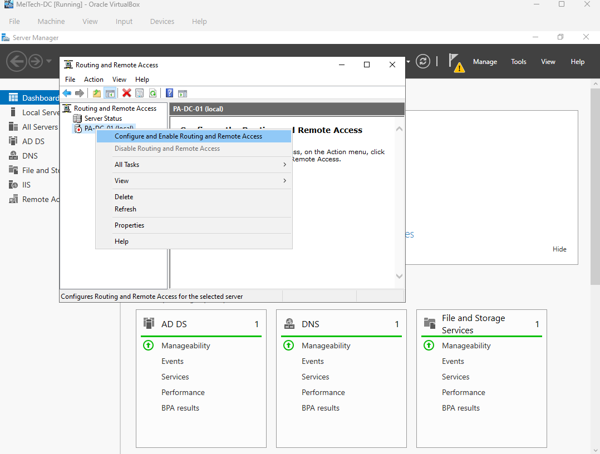
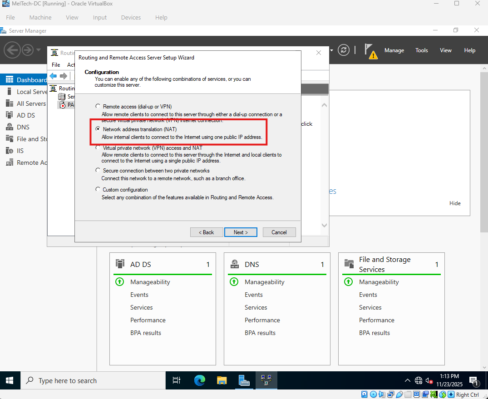
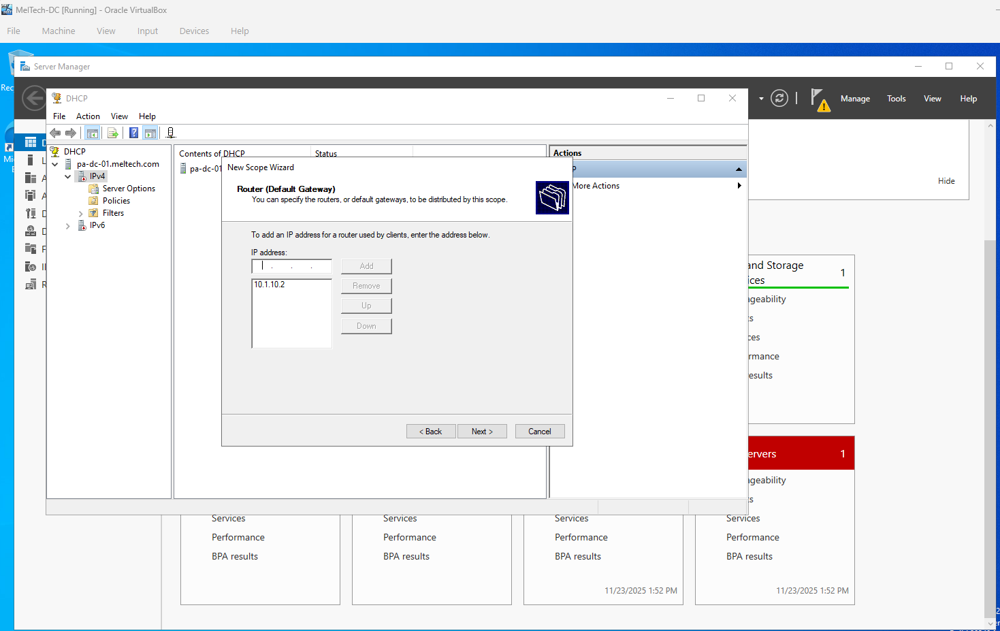
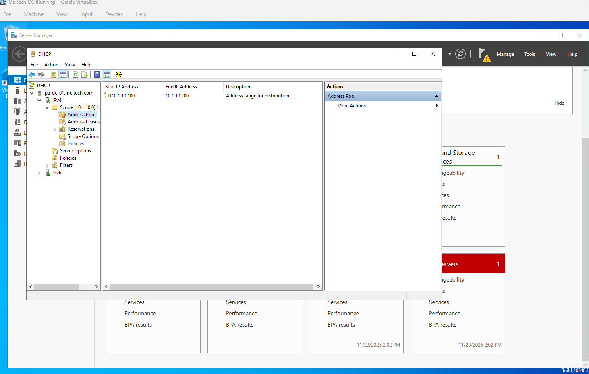

# Active Directory Home Lab Project

This project is the start of my personal IT home lab, where I’ll be getting hands-on experience with **Windows Server 2022** and **Active Directory**.

The goal is to build a small virtual network using **Oracle VirtualBox** to simulate a real-world business environment. I’ve started by downloading the core tools:

- Windows 11 ISO – for the client machine  
- Windows Server 2022 ISO – for the domain controller  
- VirtualBox – to manage and run the virtual machines

Through this project, I’ll be setting up:

- An **Active Directory Domain**  
- **User and group management**  
- **Group Policies**  
- **DNS and DHCP services**  

> **Note:** This is an ongoing project and I will continue adding more steps, screenshots, and documentation as I expand my lab.

---

## Table of Contents

1. [Step 1: Installing the ISOs in VirtualBox](#step-1-installing-the-isos-in-virtualbox)  
2. [Step 2: Installing and Configuring Active Directory](#step-2-installing-and-configuring-active-directory)  
3. [Step 3: Installing Guest Additions and Creating Users](#step-3-installing-guest-additions-and-creating-users)  
4. [Step 4: Network Configuration and Domain Connection](#step-4-network-configuration-and-domain-connection)  
5. [Step 5: User Account Management and Security Policies](#step-5-user-account-management-and-security-policies)  
6. [Step 6: Installing and Using Action1](#step-6-installing-and-using-action1)  
7. [Step 7: Updating the Lab Environment](#step-7-updating-the-lab-environment)  
8. [Step 8: Preparing for Enterprise Practice](#step-8-preparing-for-enterprise-practice)  
9. [Notes / Observations](#notes--observations)  
10. [Certifications](#certifications)  

---

## Step 1: Installing the ISOs in VirtualBox

I created two virtual machines in Oracle VirtualBox—one for **Windows Server 2022** and one for **Windows 11**. Each VM was set up using its respective ISO file. Windows Server 2022 will act as the domain controller, and Windows 11 will serve as the client machine.

**Screenshots:**  
  
  
  

---

## Step 2: Installing and Configuring Active Directory

Installed **Active Directory Domain Services (AD DS)** on Windows Server 2022 and promoted the server to a **Domain Controller**. Created a new forest and domain named **MelTech.com**, then rebooted the server to complete the setup.

**Screenshots:**  
  
  
  
  

---

## Step 3: Installing Guest Additions and Creating Users

Installed **VirtualBox Guest Additions** on the Windows Server 2022 VM to enable folder sharing between the host and VM. Created two **Active Directory user accounts**: **Thomas C Anderson** and **Melvin L Williams**, used to test domain connectivity from the client machine.

**Screenshots:**  
  
  
  

---

## Step 4: Network Configuration and Domain Connection

Configured network settings and connected the Windows 11 client to the domain. Assigned static IP addresses: `10.1.10.2` to the Windows Server 2022 Domain Controller, `10.1.10.3` to the Windows 11 client. Verified the connection by confirming **Desktop01** appeared under the Computers container in Active Directory Users and Computers. Enabled Remote Desktop access and confirmed connectivity.

**Screenshots:**  
  
  
  
  
  
  
  

---

## Step 5: User Account Management and Security Policies

Managed user accounts and applied security policies within Active Directory. Practiced resetting passwords, activating/disabling accounts, deleting accounts, and setting login hour restrictions (e.g., Thomas C Anderson Mon–Fri 6:00 a.m.–6:00 p.m.).  

Under **Group Policy**, updated security settings:

- Max password age: 90 days  
- Account lockout threshold: 3 failed attempts  
- Lockout duration: 360 minutes  

Verified the policies by testing failed logins, then unlocked accounts in **Active Directory Users and Computers**.

**Screenshots:**  
  
  
  
  
  
  
  

---

## Step 6: Installing and Using Action1

Downloaded and installed **Action1** on the Windows Server 2022 Domain Controller. Scanned for missing updates and deployed **five updates**, then ran **vulnerability remediation** to identify and address potential security risks.

**Screenshots:**  
  
  

---

## Step 7: Updating the Lab Environment

I updated the lab environment by adjusting the network adapters on the Domain Controller VM. There are now two NICs: the first adapter, labeled **Internal**, connects to the lab network with a static IP of `10.1.10.2`, and the second adapter, labeled **Internet**, uses NAT to provide access to the internet. I renamed both adapters to distinguish them clearly. The Domain Controller will act as the default gateway for the internal network, so no gateway was set on the internal NIC. DNS will also be handled by the Domain Controller.

Next, I set up a DHCP server on the Domain Controller so that client machines can receive IP addresses and access the internet through NAT. I created a new DHCP scope with an IP range from `10.1.10.100` to `10.1.10.200` and a subnet mask of `255.255.255.0`. The default gateway for the scope is the Domain Controller (`10.1.10.2`). I verified that the scope is active and that the IP pool is correctly configured and available for clients.

This step is ongoing, and I will continue adding updates and configurations as I progress through the lab.

**Screenshots:**  
  
  
  
  
  
  
  
  
  
  
  
  
  
  
  
  
  
  

---

## Step 8: Preparing for Enterprise Practice

Created and imported a batch of **1,000 Active Directory user accounts** using a structured CSV file and PowerShell automation, replicating large-scale identity provisioning workflows used in enterprise environments.

Created a new administrative user named **Melvin L Williams** with the username **a-mwilliams** and added it to the **Admins OU**, assigning **Domain Admin privileges**. Verified proper access by logging in with **a-mwilliams** to confirm administrative permissions.

This step establishes the foundation for ongoing lab exercises, where I will practice:

- Assigning permissions and managing roles for users and groups  
- Simulating enterprise workflows with a ticketing system  
- Running updates, patches, and vulnerability checks with **Action1**  
- Experimenting with Group Policies and Active Directory features in a controlled environment  

This lab serves as a **hands-on practice ground** for mastering Active Directory administration, network management, and security operations in a safe, virtualized environment.

---

## Notes / Observations

- Active Directory setup & domain management  
- Group Policy & security enforcement  
- Network configuration & client-domain connectivity  
- Patch management & vulnerability remediation  

---

## Certifications

- CompTIA Security+  
- Microsoft Azure Fundamentals (AZ-900)  
- Currently studying for Cisco CCNA
