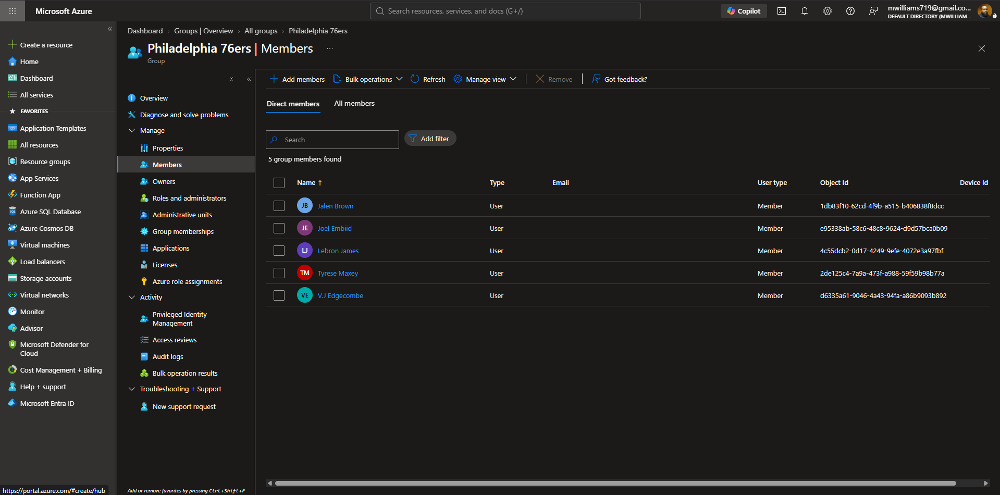
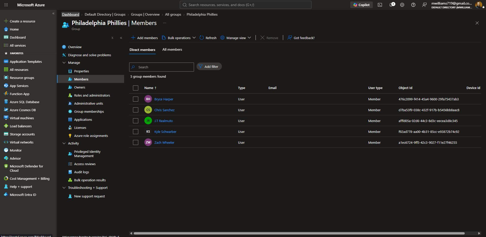
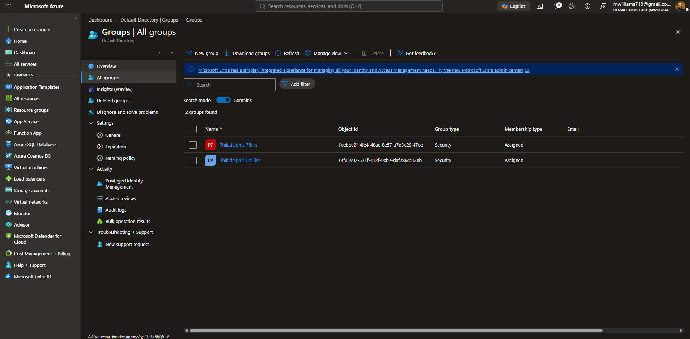
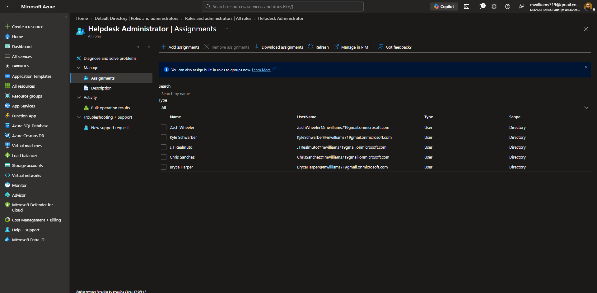
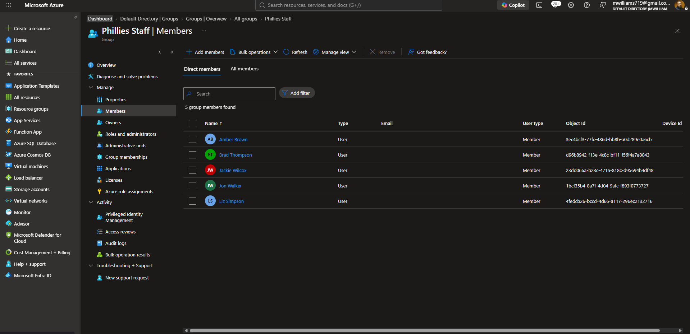
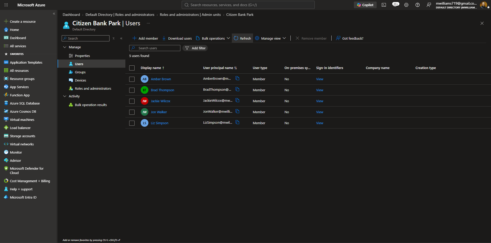

# Azure Admin Lab — Entra ID Users, Groups & Administrative Units

## Table of Contents
- [Phase 1: User & Group Foundation](#phase-1-user--group-foundation)
- [Phase 2: Expanded Groups & Role Assignments](#phase-2-expanded-groups--role-assignments)
- [Phase 3: Administrative Units & Scoped Permissions](#phase-3-administrative-units--scoped-permissions)

---

## Phase 1: User & Group Foundation

### Phase 1: Step 1 – Philadelphia 76ers Security Group

I started the lab by creating member user accounts inside my Entra ID tenant and organizing them into a Security group. Using Philadelphia sports teams as the identity structure gave the environment a realistic feel — each user represents a real person with a distinct identity, which makes permission scenarios easier to reason through as the lab progresses.

I created the `Philadelphia 76ers` group using the **Security** group type with **Assigned** membership. Assigned membership means users are added manually rather than through dynamic rules, which mirrors how most organizations manage groups for roles and access control. After adding the players as members, I confirmed each account was showing as **Member** type — meaning they are internal cloud-only accounts in the tenant, not external guests.

**Screenshot:**

---

### Phase 1: Step 2 – Philadelphia Phillies Security Group

With the 76ers group in place, I repeated the process for the second team. I created the `Philadelphia Phillies` security group and added 5 players as member users. Having two parallel groups from the start allows the lab to demonstrate how permissions and roles can be applied independently to different groups within the same tenant — which becomes important once Administrative Units are introduced in Phase 3.

After confirming the members, both groups were visible in the **All Groups** view showing Security type and Assigned membership for each.

**Screenshots:**

---

## Phase 2: Expanded Groups & Role Assignments

### Phase 2: Step 1 – Helpdesk Administrator Role Assignment

With users and groups established, the next step was assigning directory roles to simulate a real IT operations structure. I navigated to **Roles and administrators** in Entra ID and opened the **Helpdesk Administrator** built-in role. This role allows the assigned users to reset passwords and manage service requests for non-administrative accounts — a common responsibility for IT staff in any organization.

I assigned all 5 Phillies players to this role at **Directory** scope, meaning their permissions apply across the entire tenant rather than being restricted to a specific subset. This sets up the contrast that comes later in Phase 3, where the same users will also have a second role assignment that is deliberately scoped down using an Administrative Unit.

**Screenshot:**

---

### Phase 2: Step 2 – Staff & Fan Groups

To build out the full identity structure, I created three additional Security groups: `76ers Staff`, `Phillies Staff`, and `Fans`. The staff groups represent the non-player employees associated with each organization — these are the accounts that the team admins will eventually be responsible for managing. The Fans group represents a general user population that sits outside either team's organizational structure.

All groups were created with Security type and Assigned membership, consistent with the groups from Phase 1.

**76ers Staff** — Max Smith, Nichole Frank, Sam Adams, Sarah Greene, Steve Jones

**Phillies Staff** — Amber Brown, Brad Thompson, Jackie Wilcox, Jon Walker, Liz Simpson

**Fans** — Brittney Jefferson, James Washington, Jerry Thomas, Kevin Stevenson, Larry Jackson

With all groups created, the All Groups view confirmed 5 total security groups in the tenant.

---

## Phase 3: Administrative Units & Scoped Permissions

### Phase 3: Step 1 – Citizen Bank Park Administrative Unit

The Helpdesk Administrator role assigned in Phase 2 gives the Phillies players broad access across the entire directory. In most organizations, that level of access is wider than necessary — an IT admin for one department shouldn't have the ability to reset passwords for users in a completely different part of the organization. Administrative Units solve this by restricting the *scope* of a role assignment to a defined subset of the directory rather than the whole tenant.

I created an Administrative Unit named `Citizen Bank Park` — the Phillies' home stadium — to represent the boundary of the Phillies IT team's authority. During the AU creation wizard, I assigned the **Password Administrator** role to the 5 Phillies players directly within the AU setup, scoping that permission to only the users who would be added as AU members.

**Screenshot:**

After creating the AU, I added the **Phillies Staff** users as members. These are the accounts the scoped Password Administrators can manage — they can reset passwords for any of these 5 users, but their Password Administrator role has no effect on anyone outside this AU.

The result is a layered permission model: the Phillies players hold **Helpdesk Administrator** at directory scope (broad) and **Password Administrator** scoped to Citizen Bank Park (narrow). The same pattern will be replicated for the 76ers in the next phase.

**Screenshot:**

