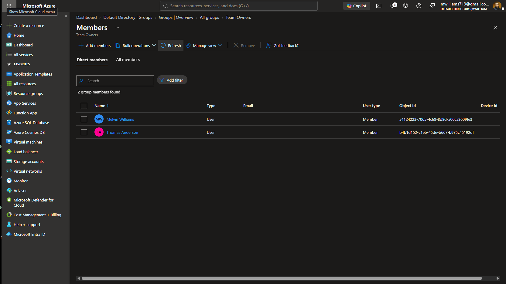
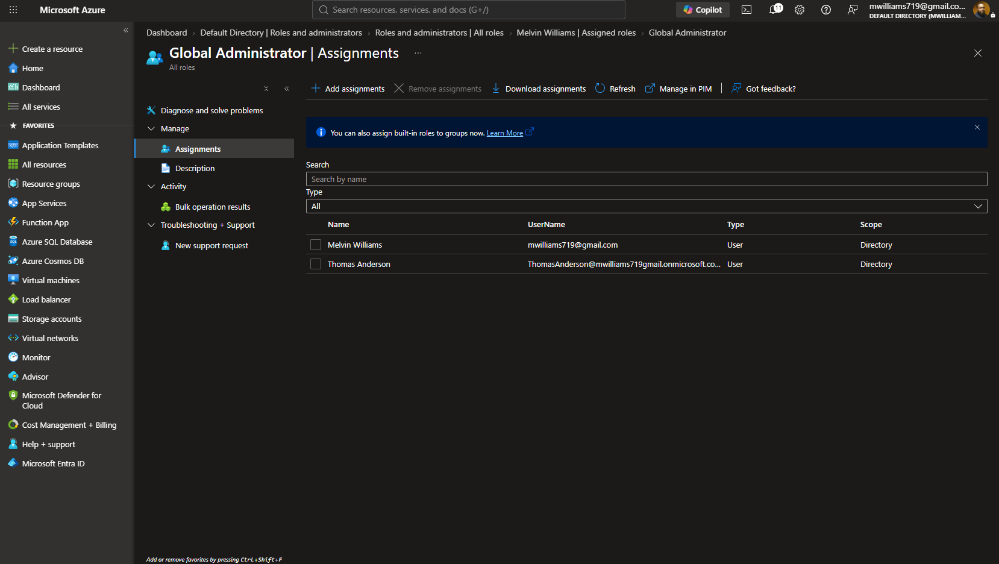
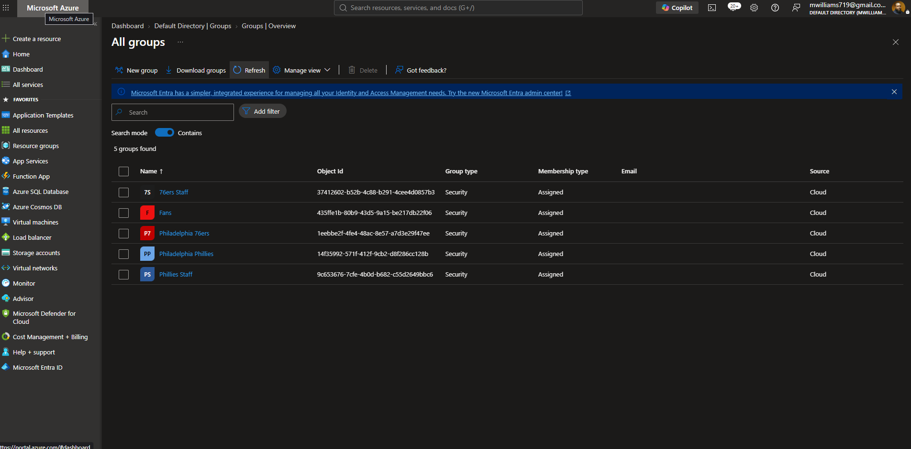
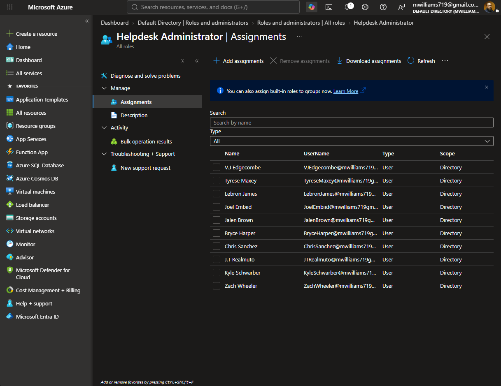
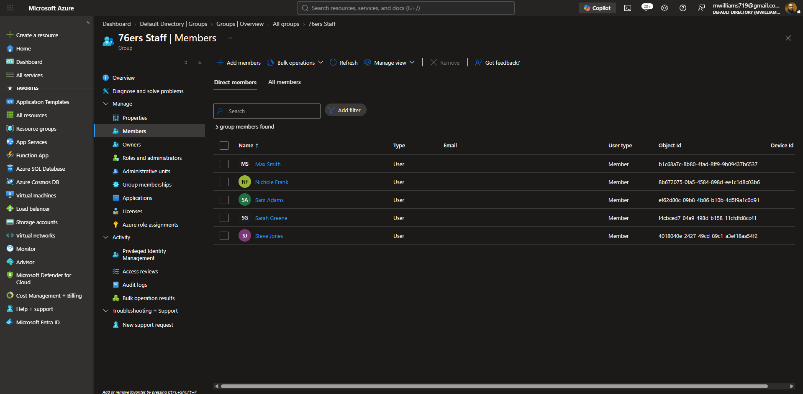
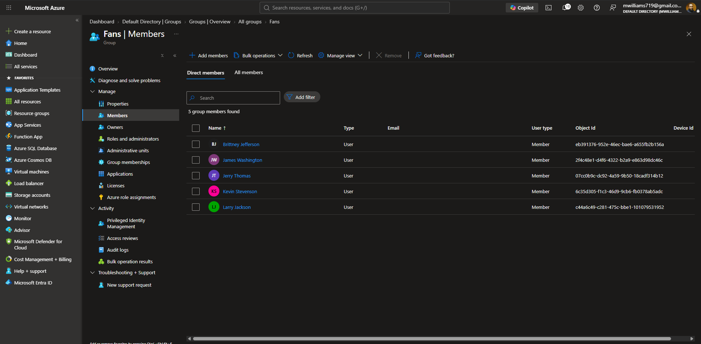
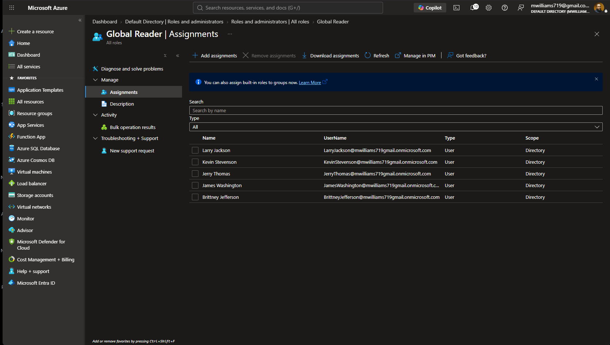
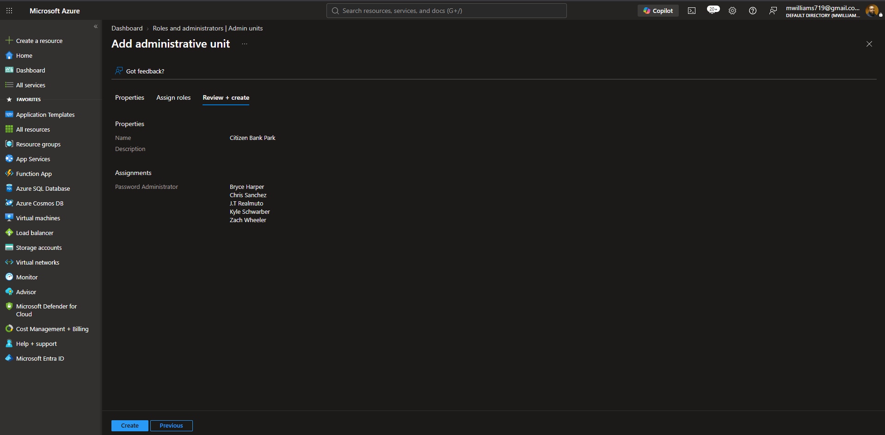
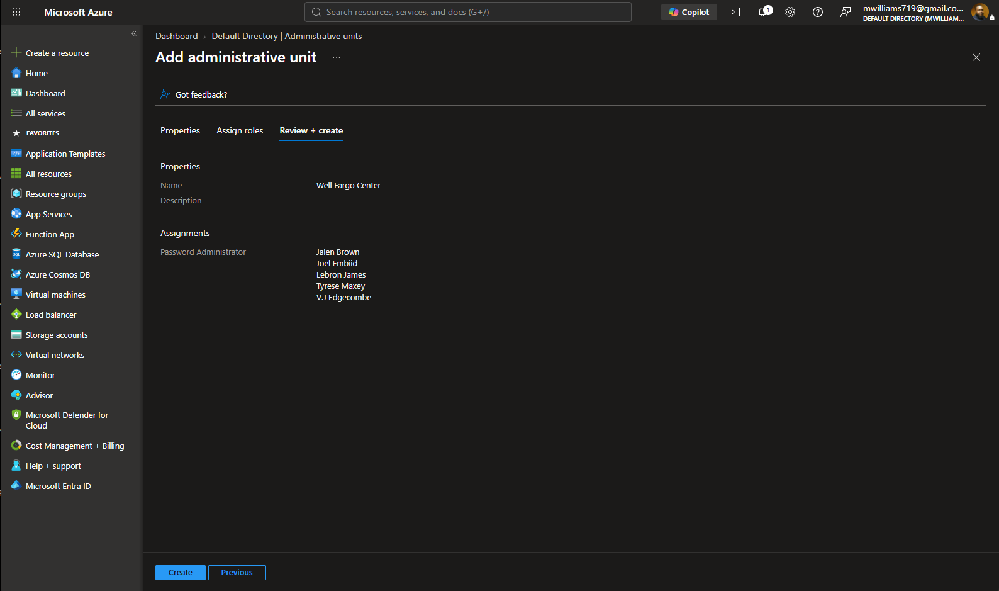
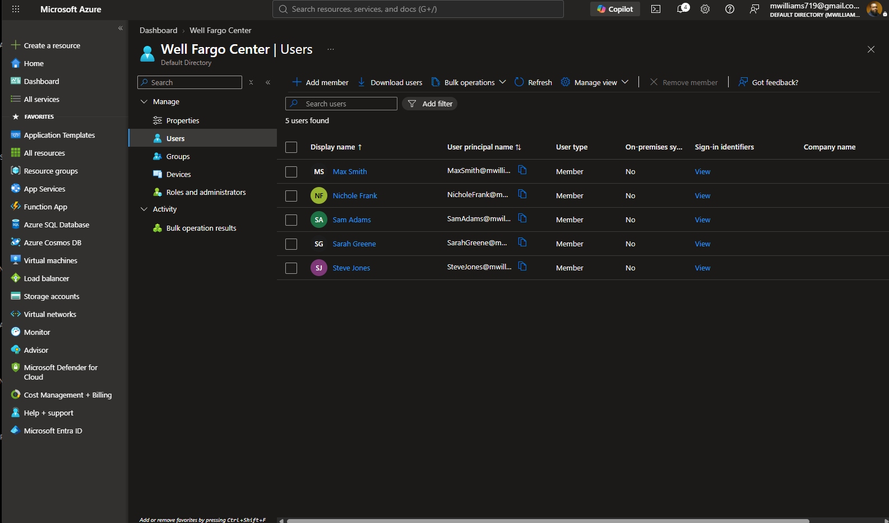

# Azure Administrator Lab

A hands-on Azure lab built in a real tenant, using Philadelphia sports organizations as the identity framework. Covers identity and access management, networking, compute, storage, and more as the lab expands.

**Technology:** Microsoft Azure · Microsoft Entra ID · Azure Networking · Compute · Storage
**License:** MIT · **Status:** In Progress

**Technology:** Microsoft Azure · Microsoft Entra ID  
**License:** MIT · **Status:** In Progress

---

## Org Structure

| Group | Role | Scope |
|---|---|---|
| Team Owners (Philly Owners) | Global Administrator | Tenant-wide |
| Philadelphia 76ers | Helpdesk Administrator | Directory |
| Philadelphia Phillies | Helpdesk Administrator | Directory |
| 76ers Staff | No admin role | Standard users |
| Phillies Staff | No admin role | Standard users |
| Fans | Global Reader | Directory (read-only) |

---

## Phase 1 — Foundation: Users, Groups & Ownership

Created two security groups — Philadelphia 76ers and Philadelphia Phillies — as the base identity structure. Both use assigned membership (not dynamic rules). A separate **Team Owners** group was created for Melvin Williams and Thomas Anderson, both assigned **Global Administrator** at directory scope.

**Design decision:** Global Admin is limited to exactly 2 users (the org owners). Microsoft recommends no more than 5. Every other role is scoped by function.

### Initial Security Groups

*Philadelphia 76ers and Philadelphia Phillies created as security groups with assigned membership.*

### Team Owners Group

*Team Owners contains Melvin Williams and Thomas Anderson — the two Global Administrators.*

### Global Administrator Assignments

*Global Admin role scoped to exactly 2 users. Everyone else gets least-privilege role assignments.*

---

## Phase 2 — Expanded Groups & Role Assignments

Expanded the identity environment with four additional security groups: **76ers Staff**, **Phillies Staff**, **Fans**, and the existing player groups now with role assignments. Each population gets a role that matches what they actually need.

### All Groups Overview

*Five security groups in the tenant: 76ers Staff, Fans, Philadelphia 76ers, Philadelphia Phillies, Phillies Staff — all Security type with Assigned membership.*

### Helpdesk Administrator — Both Teams

The players from both the Sixers and Phillies are assigned the **Helpdesk Administrator** role at Directory scope. This gives them the ability to reset passwords and manage basic user issues across the tenant.

*All 10 players (5 Sixers + 5 Phillies) assigned Helpdesk Administrator at Directory scope.*

### 76ers Staff Members

*76ers Staff group: Max Smith, Nichole Frank, Sam Adams, Sarah Greene, Steve Jones — standard users with no admin role.*

### Phillies Staff Members

*Phillies Staff group: Amber Brown, Brad Thompson, Jackie Wilcox, Jon Walker, Liz Simpson — standard users with no admin role.*

### Fans Group Members

*Fans group: Brittney Jefferson, James Washington, Jerry Thomas, Kevin Stevenson, Larry Jackson — representing public-facing accounts.*

### Global Reader — Fans

Fans are assigned **Global Reader** at Directory scope. They can see the environment but cannot change anything. This demonstrates least-privilege: public accounts get read-only access, nothing more.

*All 5 Fans users assigned Global Reader — read-only access to the entire directory.*

---

## Phase 3 — Administrative Units: Scoped Permission Model

Administrative Units restrict where a role applies. The same Helpdesk Admin users who have broad tenant-wide access (Phase 2) also hold a **Password Administrator** role — but only within their own org's AU. This creates a layered permission model.

**The design:** A Phillies player can reset any password tenant-wide as Helpdesk Admin — but their Password Admin role is locked to the Phillies Staff AU. A Sixers player's Password Admin role is locked to the Sixers Staff AU. Neither team can touch the other's staff.

### Citizen Bank Park — Phillies AU

**Citizen Bank Park** is the Administrative Unit for the Phillies organization. Phillies players (Bryce Harper, Chris Sanchez, J.T. Realmuto, Kyle Schwarber, Zach Wheeler) are scoped as Password Administrators within this AU. The AU's members are the Phillies Staff.

*Creating Citizen Bank Park AU — Phillies players assigned Password Administrator scoped to this unit only.*

*Citizen Bank Park AU members: the 5 Phillies Staff users. Phillies players can only reset passwords for these accounts.*

### Wells Fargo Center — 76ers AU

**Wells Fargo Center** is the Administrative Unit for the 76ers organization. Sixers players (Jalen Brown, Joel Embiid, LeBron James, Tyrese Maxey, V.J. Edgecombe) are scoped as Password Administrators within this AU. The AU's members are the 76ers Staff.

*Creating Wells Fargo Center AU — Sixers players assigned Password Administrator scoped to this unit only.*

*Wells Fargo Center AU members: the 5 Sixers Staff users. Sixers players can only reset passwords for these accounts.*

---

## Key Concepts Demonstrated

- **Least-privilege access** — every role is assigned based on what the user actually needs, nothing more
- **Role separation** — Global Admin limited to 2 users; Helpdesk Admin for operations; Global Reader for public accounts
- **Administrative Units** — scoping the same users to different permission boundaries simultaneously
- **Layered permission model** — broad role (Helpdesk Admin) + scoped role (Password Admin in AU) on the same user
- **Security group design** — assigned membership groups organized by org function rather than by individual

---

## Status

| Phase | Description | Status |
|---|---|---|
| Phase 1 | Users, groups, Team Owners, Global Admin | Complete |
| Phase 2 | Staff/Fan groups, Helpdesk Admin, Global Reader | Complete |
| Phase 3 | Administrative Units (CBP + WFC) | Complete |
