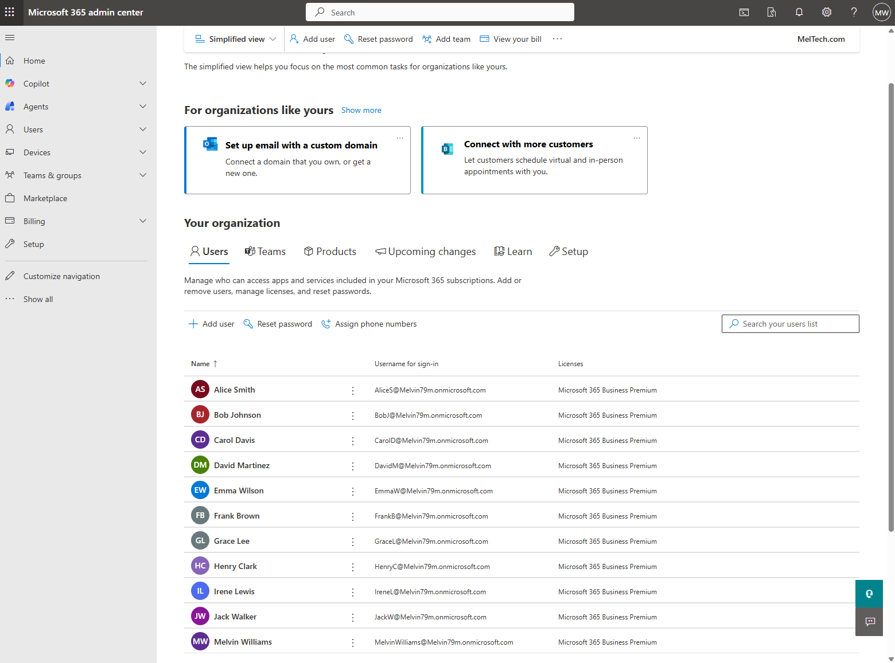
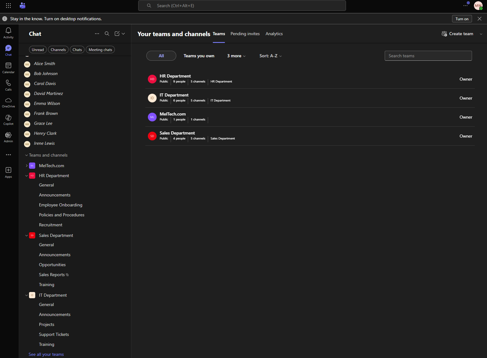
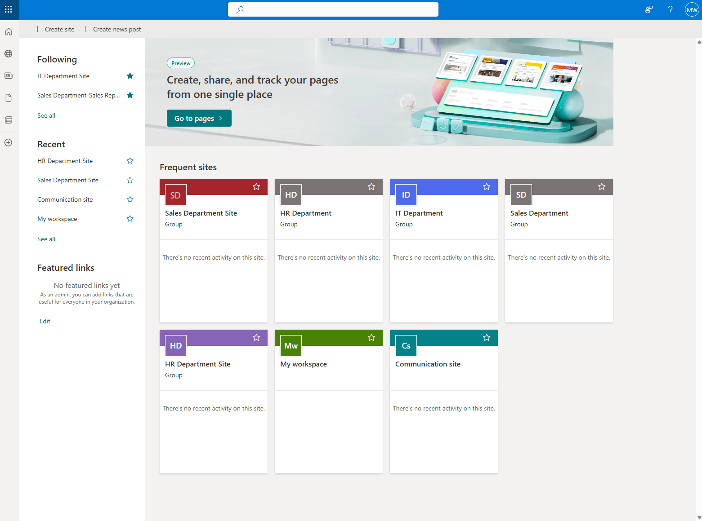
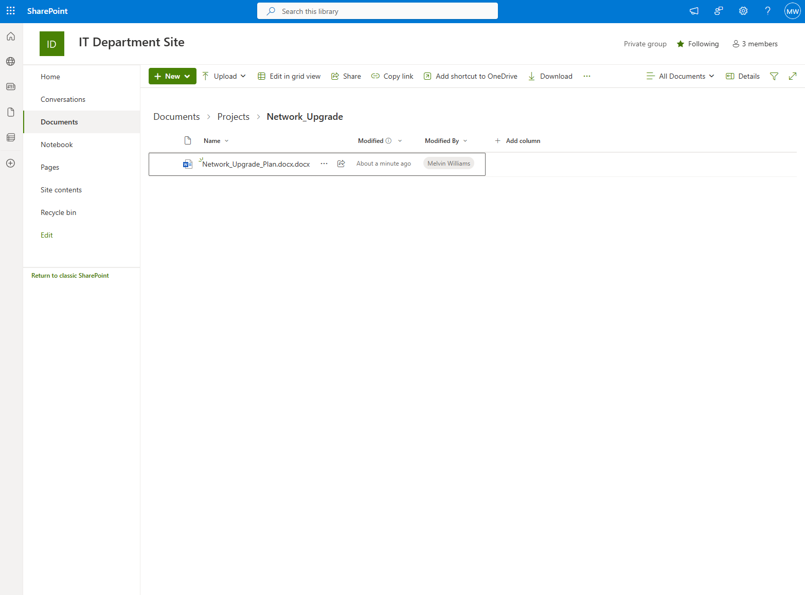
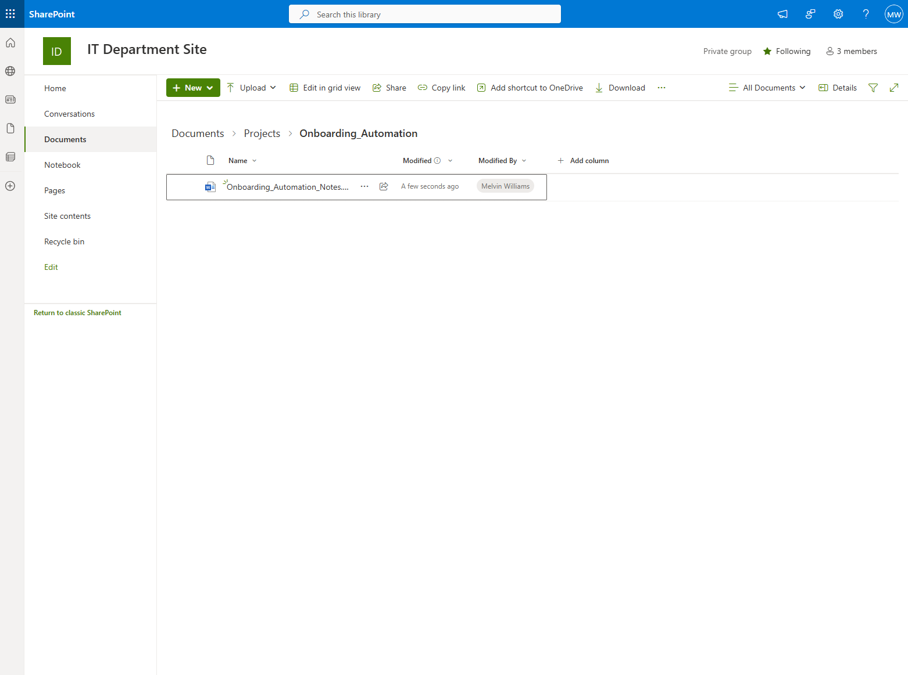
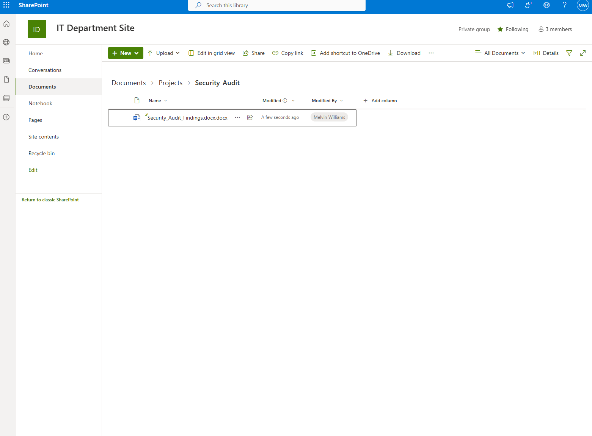
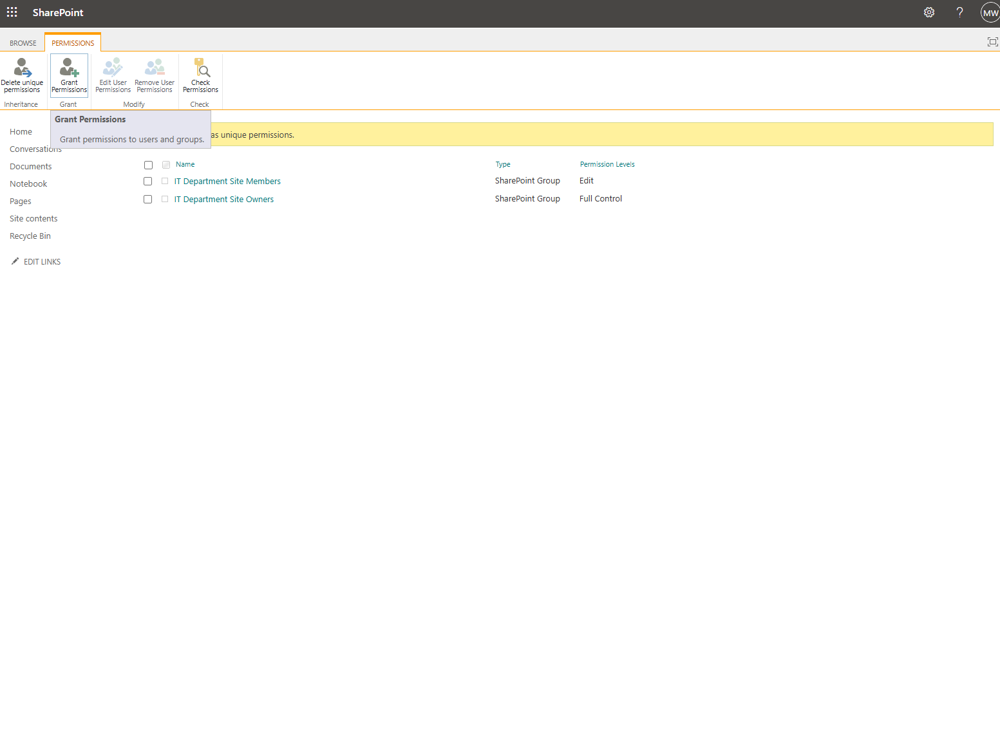
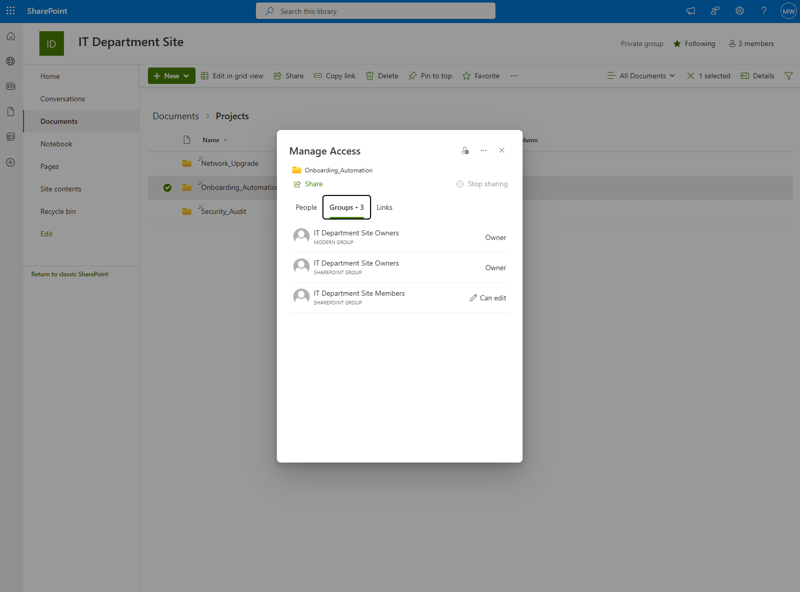
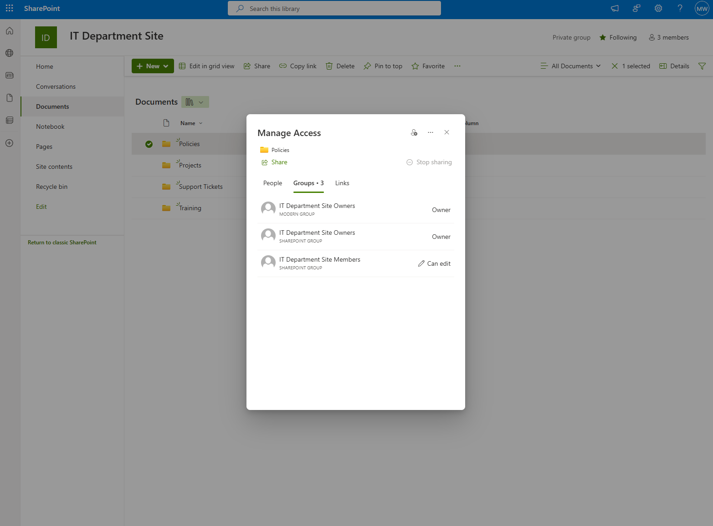
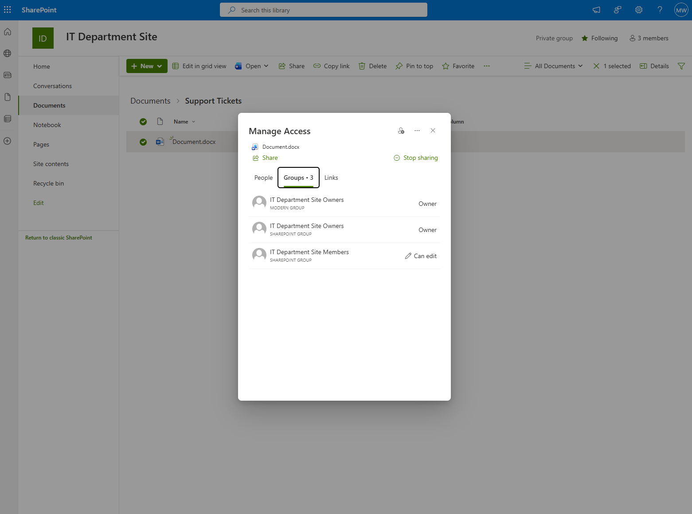

# Microsoft 365 Lab

This lab documents the setup and administration of a Microsoft 365 environment for hands-on learning. The goal is to simulate real-world collaboration, permissions, security, and troubleshooting workflows to prepare for helpdesk or sysadmin roles.

---

## Table of Contents

| Step | Title | Description |
| --- | --- | --- |
| [Step 1](#step-1-tenant-and-user-setup) | Tenant and User Setup | Create a clean tenant, configure users, Teams, SharePoint sites, folders, and permissions. |
| [Step 2](#step-2-mailbox-and-onedrive-setup) | Mailbox and OneDrive Setup | Assign mailboxes, configure OneDrive, upload sample files, and configure sharing. |
| [Step 3](#step-3-security-and-compliance) | Security and Compliance | Configure MFA, conditional access, DLP policies, sensitivity labels, and test access. |
| [Step 4](#step-4-groups-and-roles) | Groups and Roles | Create security groups, Microsoft 365 groups, and role-based access with proper permissions. |
| [Step 5](#step-5-collaboration-labs) | Collaboration Labs | Simulate Teams, SharePoint, and OneDrive collaboration scenarios. |
| [Step 6](#step-6-end-user-troubleshooting) | End-User Troubleshooting | Simulate mailbox, OneDrive, and permissions issues and document troubleshooting steps. |

---

## Step 1: Tenant and User Setup

This step documents the initial Microsoft 365 tenant configuration including users, Teams, SharePoint sites, and folder permissions.

### Lab Tenant Setup

- Tenant Domain: [Melvin79m.onmicrosoft.com](http://melvin79m.onmicrosoft.com/)  
- Global Admin Account: [MelvinWilliams@Melvin79m.onmicrosoft.com](mailto:MelvinWilliams@Melvin79m.onmicrosoft.com)  
- Subscription: Microsoft 365 Business Premium Trial (1 month, 10 users)  

### Users Created

| Display Name | Username | License |
| --- | --- | --- |
| Alice Smith | [AliceS@Melvin79m.onmicrosoft.com](mailto:AliceS@Melvin79m.onmicrosoft.com) | Microsoft 365 Business Premium |
| Bob Johnson | [BobJ@Melvin79m.onmicrosoft.com](mailto:BobJ@Melvin79m.onmicrosoft.com) | Microsoft 365 Business Premium |
| Carol Davis | [CarolD@Melvin79m.onmicrosoft.com](mailto:CarolD@Melvin79m.onmicrosoft.com) | Microsoft 365 Business Premium |
| David Martinez | [DavidM@Melvin79m.onmicrosoft.com](mailto:DavidM@Melvin79m.onmicrosoft.com) | Microsoft 365 Business Premium |
| Emma Wilson | [EmmaW@Melvin79m.onmicrosoft.com](mailto:EmmaW@Melvin79m.onmicrosoft.com) | Microsoft 365 Business Premium |
| Frank Brown | [FrankB@Melvin79m.onmicrosoft.com](mailto:FrankB@Melvin79m.onmicrosoft.com) | Microsoft 365 Business Premium |
| Grace Lee | [GraceL@Melvin79m.onmicrosoft.com](mailto:GraceL@Melvin79m.onmicrosoft.com) | Microsoft 365 Business Premium |
| Henry Clark | [HenryC@Melvin79m.onmicrosoft.com](mailto:HenryC@Melvin79m.onmicrosoft.com) | Microsoft 365 Business Premium |
| Irene Lewis | [IreneL@Melvin79m.onmicrosoft.com](mailto:IreneL@Melvin79m.onmicrosoft.com) | Microsoft 365 Business Premium |
| Jack Walker | [JackW@Melvin79m.onmicrosoft.com](mailto:JackW@Melvin79m.onmicrosoft.com) | Microsoft 365 Business Premium |
| Melvin Williams | [MelvinWilliams@Melvin79m.onmicrosoft.com](mailto:MelvinWilliams@Melvin79m.onmicrosoft.com) | Microsoft 365 Business Premium |

Note: All users had passwords set and are required to change them at first login.

### Teams Setup

| Team Name | Members | Channels |
| --- | --- | --- |
| IT Department | 6 | Announcements, Projects, Support Tickets, Training, General |
| Sales Department | 4 | General, Opportunities, Sales Reports, Training, Announcements |
| HR Department | 9 | General, Policies & Procedures, Recruitment, Employee Onboarding, Announcements |

### SharePoint Sites Setup

| Site Name | Linked Team | Privacy |
| --- | --- | --- |
| IT Department Site | IT Department | Private |
| Sales Department Site | Sales Department | Private |
| HR Department Site | HR Department | Private |

Template Used: Standard team template from Microsoft.

### SharePoint Folder Structure & Permissions

| Folder | Description | Permissions | Notes |
| --- | --- | --- | --- |
| Projects | Contains IT projects with subfolders: Network_Upgrade, Onboarding_Automation, Security_Audit | Inherited from library: Owners=Full Control, Members=Edit | Placeholder files added to each subfolder |
| Policies | Company policies | Custom: Owners=Full Control, Members=Edit | Non-IT read access documented |
| Support Tickets | IT service tickets | Custom: Owners=Full Control, Members=Edit | Restricted to IT only |
| Training | IT training materials | Custom: Owners=Full Control, Members=Edit | Non-IT read access documented |

Note: Due to Microsoft 365 trial tenant limitations, non-IT users could not be added to read-only groups.

### Projects Subfolders Example

| Subfolder | Placeholder Files | Permissions |
| --- | --- | --- |
| Network_Upgrade | README.md, Network_Upgrade_Plan.docx | Inherited from library |
| Onboarding_Automation | README.md, Automation_Script.docx | Inherited from library |
| Security_Audit | README.md, Audit_Report.xlsx | Inherited from library |

### Screenshot Evidence – Step 1

Screenshots are located in `O365Lab/` and will render inline automatically.

#### Tenant & Admin Configuration

#### Microsoft Teams Configuration

#### SharePoint Site Structure

#### Project Folder Organization

#### SharePoint Permissions & Access Control

---

## Step 2: Mailbox and OneDrive Setup

*(To be added – screenshots and documentation)*

---

## Step 3: Security and Compliance

*(To be added – screenshots and documentation)*

---

## Step 4: Groups and Roles

*(To be added – screenshots and documentation)*

---

## Step 5: Collaboration Labs

*(To be added – screenshots and documentation)*

---

## Step 6: End-User Troubleshooting

*(To be added – screenshots and documentation)*

---

## Outcome

At the completion of all steps, this lab demonstrates:

- Microsoft 365 tenant setup and user management  
- Teams and SharePoint site configuration  
- Folder structure, permissions, and least privilege implementation  
- Mailbox and OneDrive setup for end-user workflows  
- Security policies, groups, and role management  
- Troubleshooting end-user issues and collaboration scenarios  

This lab provides a **complete hands-on portfolio project** suitable for GitHub and resume demonstration.
