# New Active Directory Lab Using Proxmox

## Table of Contents
- [Phase 1: Core Infrastructure Foundation](#phase-1-core-infrastructure-foundation)
- [Phase 2: Workstation Integration & Domain Validation](#phase-2-workstation-integration--domain-validation)
- [Phase 3: Organizational Hierarchy & User Provisioning](#phase-3-organizational-hierarchy--user-provisioning)
- [Phase 4: Service Desk Operations & Access Control](#phase-4-service-desk-operations--access-control)
- [Phase 5: Corporate Shared Resources & Data Governance](#phase-5-corporate-shared-resources--data-governance)

---

## Phase 1: Core Infrastructure Foundation

### Phase 1: Step 1 – Static IP Configuration
I initiated the lab setup by transitioning the Windows Server 2022 instance from a dynamic to a static network configuration. By manually assigning an IPv4 address, subnet mask, and default gateway based on my local network's architecture, I ensured that the server maintains a permanent address that won't change after reboots. I configured the Preferred DNS to 127.0.0.1, pointing the server to itself in preparation for its role as a Domain Controller, and added 8.8.8.8 as an Alternate DNS to maintain internet access during the transition. This creates a stable foundation for the Active Directory services that will rely on this fixed identity.

**Screenshot:**

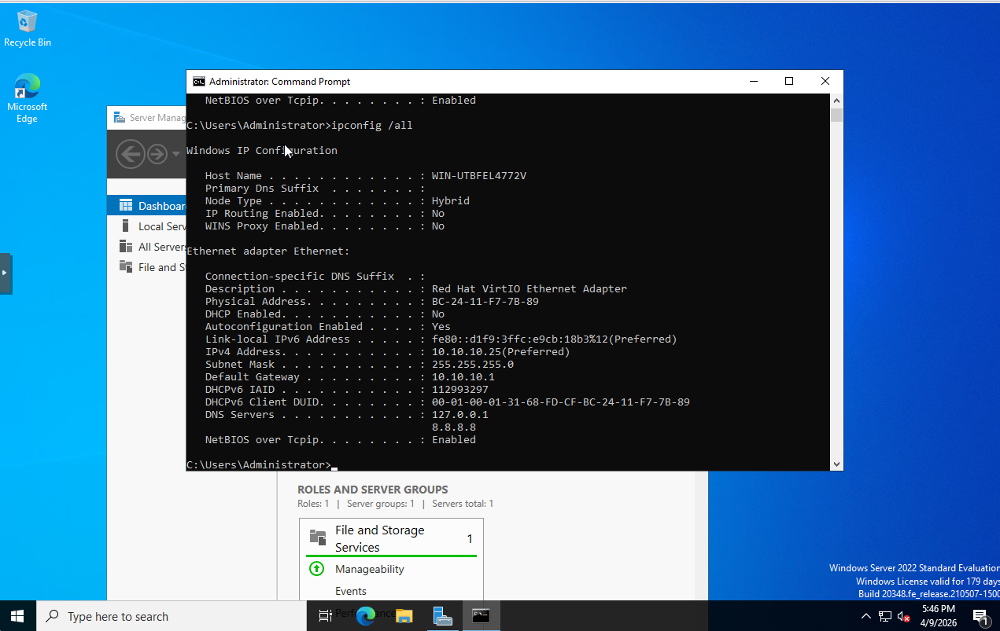

---

### Phase 1: Step 2 – Naming the Server and Installing the AD Role
After establishing the network settings, I moved into the system configuration phase by renaming the server to MEL-DC-01. Standardizing the host name is a critical best practice before promotion to ensure the Active Directory database reflects a professional naming convention. Once the server rebooted to apply the new name, I utilized Server Manager to install the Active Directory Domain Services (AD DS) role. This process loaded the necessary binaries and management consoles onto the OS, officially preparing the machine to be promoted to the primary Domain Controller for the lab environment.

**Screenshot:**

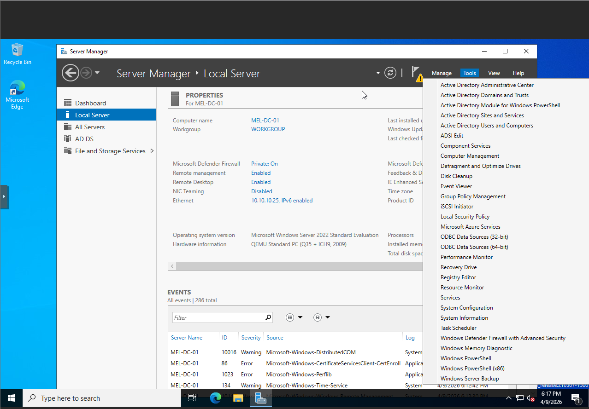

---

### Phase 1: Step 3 – Domain Promotion and Forest Creation
The final stage of the foundation involved promoting the server to a Domain Controller by initiating a new Active Directory forest. I designated the root domain as MELVINLAB.local and configured the Directory Services Restore Mode (DSRM) with a secure recovery password to ensure administrative access in the event of database corruption. During this process, the server automatically configured the DNS role and established the global catalog and schema partitions. Upon completion of the promotion and a final system reboot, I verified the success of the installation by logging in with domain administrator credentials. This successfully establishes MEL-DC-01 as the central identity and authentication authority for the entire lab environment.

**Screenshot:**

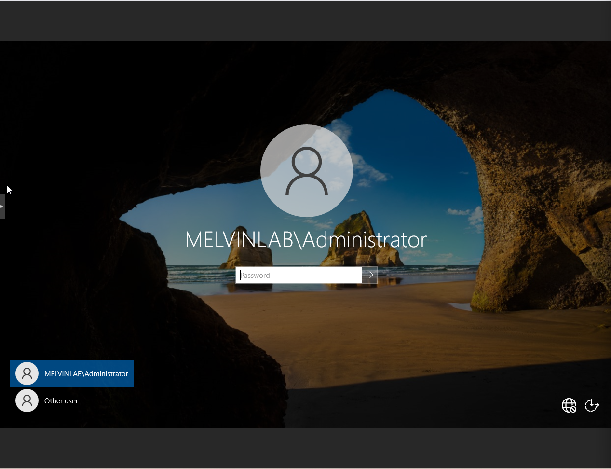

---

## Phase 2: Workstation Integration & Domain Validation

### Phase 2: Step 1 – Network Adapter & Driver Configuration
One of the first things I ran into when setting up the Windows 11 VM was that Proxmox uses a VirtIO network adapter by default — which is great for performance, but Windows doesn't have VirtIO drivers built in. So when I booted into Windows for the first time, there was no network adapter showing up at all. I couldn't ping anything, couldn't reach the domain controller, and couldn't join the domain.

I had two options: install the VirtIO drivers from the virtio-win ISO that was already mounted in Proxmox, or switch the adapter type to something Windows already knows how to handle. I went with switching to the Intel E1000 adapter inside the Proxmox VM hardware settings, since Windows 11 has built-in drivers for it and it gets the machine online immediately without any extra steps. Once I made the change and rebooted, Windows detected the adapter automatically.

After the adapter was visible, I set the DNS server on the client to point directly to MEL-DC-01 at 10.10.10.25. This step is critical — without pointing DNS at the domain controller, Windows has no way to locate or resolve the domain, and the join will fail even if everything else is correct.

**Screenshots:**

`Lab.4` – Proxmox VM hardware settings showing the network adapter type set to Intel E1000 *(screenshot coming soon)*

`Lab.5` – Windows 11 Network Adapter settings showing DNS pointed to 10.10.10.25 (MEL-DC-01) *(screenshot coming soon)*

---

### Phase 2: Step 2 – Standardized Domain Join
The primary objective of this phase was to integrate the Windows 11 workstation into the established melvinlab.local forest. I standardized the client naming convention to MEL-CL-01 to align with the infrastructure schema and configured the network interface to utilize MEL-DC-01 (10.10.10.25) as the primary DNS resolver. By authenticating with administrative credentials, I successfully joined the workstation to the domain, establishing the trust relationship required for centralized management and future Group Policy deployment.

**Screenshots:**

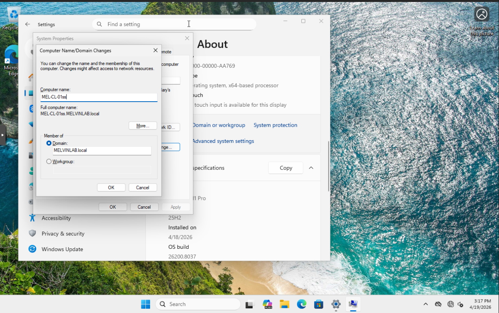

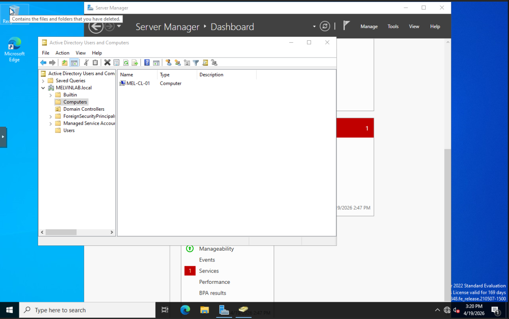

---

## Phase 3: Organizational Hierarchy & User Provisioning

### Phase 3: Step 1 – Organizational Unit (OU) Architecture
With the core domain infrastructure established, I moved into the design and implementation of the directory's logical structure. I created a top-level Parent OU, MelvinLab_users, to house all lab-specific data and separate it from default system containers. Within this root, I architected a nested OU hierarchy—specifically creating an Admins OU for privileged accounts and a Departments OU for standard business units (IT, HR, Finance, and Sales). This structure is a professional best practice that facilitates granular Group Policy targeting and delegated administrative permissions in future lab phases.

**Screenshot:**

---

### Phase 3: Step 2 – Manual User Provisioning & Identity Management
To build muscle memory for common Service Desk tasks, I manually provisioned 20 standard unique user accounts across the departmental OUs. I implemented a standardized naming convention of Firstname + LastInitial (e.g., MelvinW) to ensure consistency across the global address list. During the creation process, I enforced account security by enabling the "User must change password at next logon" attribute, simulating a real-world onboarding scenario where user privacy and initial credential rotation are required.

**Screenshot:**

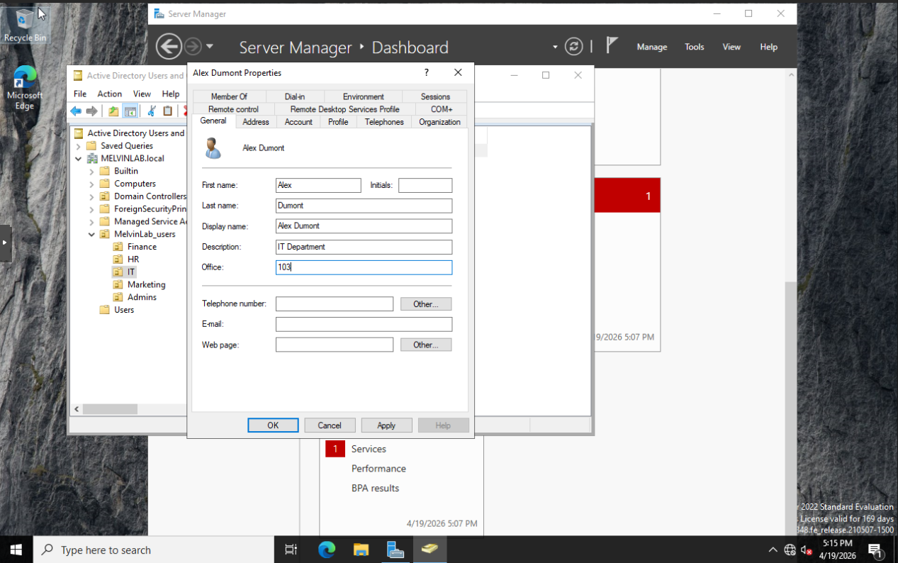

---

### Phase 3: Step 3 – Administrative Escalation and Role Assignment
The final step of this phase involved the creation of dedicated administrative identities to practice the principle of least privilege. I provisioned a secondary admin account, ThomasA, within the Admins OU to serve as a backup to my primary account. I then manually escalated these accounts by modifying their Member Of attributes to include the Domain Admins security group. This ensures that administrative tasks are performed by designated identities rather than using the default built-in Administrator account.

**Screenshot:**

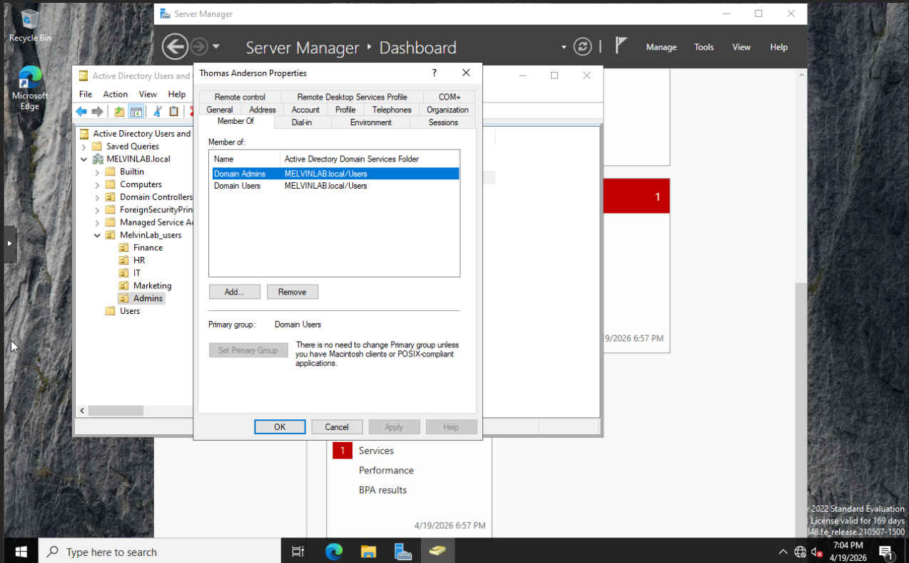

---

## Phase 4: Service Desk Operations & Access Control

### Phase 4: Step 1 – Security Group Implementation & RBAC
To transition from individual account management to Role-Based Access Control (RBAC), I implemented a Global Security Group strategy. I created departmental groups (e.g., GS_IT_Staff, GS_HR_Staff) within the MelvinLab_users OU hierarchy. By nesting the individual user accounts into these security groups, I established a scalable permission model. This ensures that future resource access—such as file shares or application permissions—can be managed at the group level rather than on a per-user basis, significantly reducing administrative overhead and the potential for permission creep.

**Screenshot:**

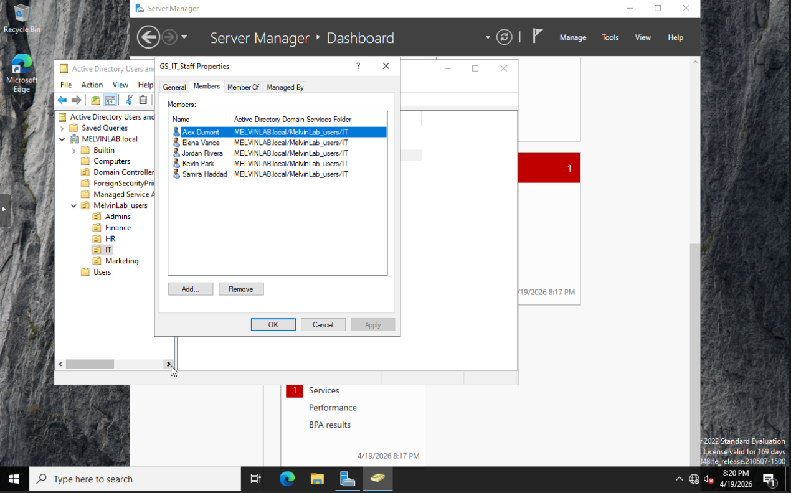

---

### Phase 4: Step 2 – Delegated Local Administration
I practiced the principle of least privilege by delegating local administrative authority without compromising domain-wide security. Instead of granting "Domain Admin" rights to technical staff for local troubleshooting, I modified the Local Administrators group on the MEL-CL-01 workstation. By adding the GS_IT_Staff security group to the local machine's administrative database, I enabled all members of the IT department to perform elevated tasks (such as software installations and system configuration) on that specific endpoint while maintaining their status as standard users across the rest of the forest.

**Screenshot:**

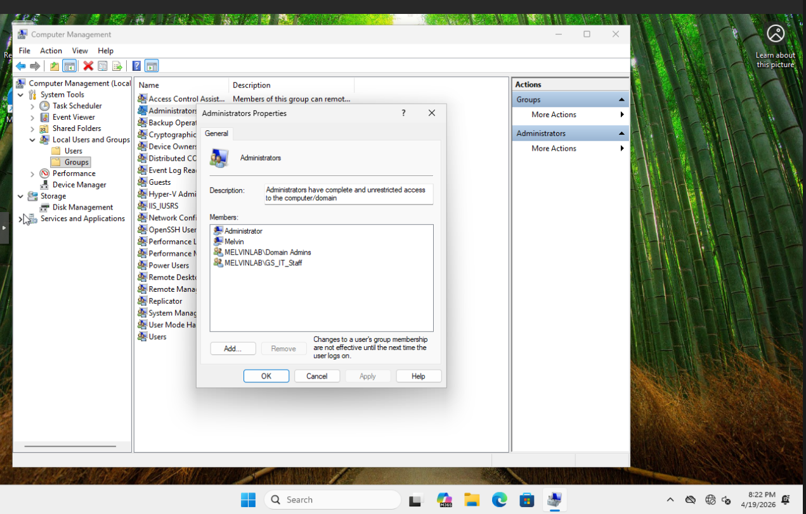

---

### Phase 4: Step 3 – Group Membership Verification
To confirm that the domain-level permissions were correctly inherited by the client workstation, I performed a technical verification via the command line. By logging into the MEL-CL-01 workstation as a departmental user and executing the `whoami /groups` command, I verified that the user's access token correctly reflected their membership in the GS_IT_Staff group. This confirms that the trust relationship between the client and the Domain Controller is healthy and that permissions are propagating as intended across the network.

**Screenshot:**

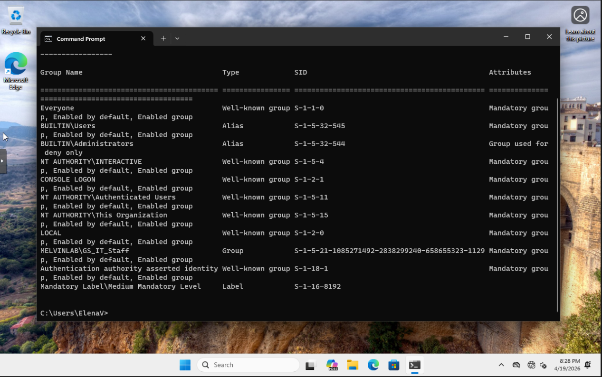

---

## Phase 5: Corporate Shared Resources & Data Governance

### Phase 5: Step 1 – Centralized File Share
With the identity and access control layer fully in place, I moved into one of the most common real-world tasks in a corporate environment — setting up centralized file storage. Rather than letting users save files locally on their own machines, which creates data silos and makes backups nearly impossible, the goal here was to create a single location on the server where each department has their own dedicated space.

I created a root folder called DeptShares directly on the C: drive of MEL-DC-01, then built out five subfolders inside it — one for IT, HR, Finance, Marketing, and a Public folder for cross-departmental access. From there I shared each folder over the network using Windows' Advanced Sharing settings, assigning Full Control at the share permission level.

The reason for giving Everyone Full Control at the share level is intentional — it's a best practice to keep share permissions wide open and let NTFS handle the actual security restrictions. Trying to manage access at both layers simultaneously creates confusion and makes troubleshooting a nightmare. One layer of truth, one place to manage it.

**Screenshots:**

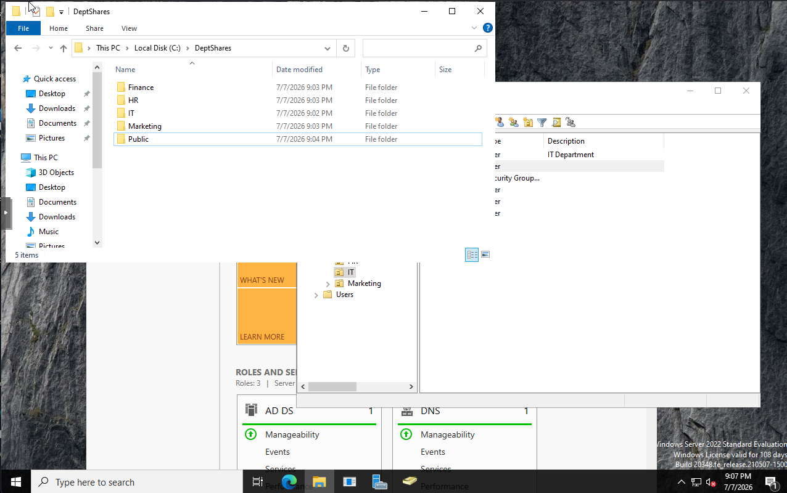

---

### Phase 5: Step 2 – NTFS Permissions & Access Control
With the shares created, the next step was locking them down properly using NTFS permissions. This is where the actual security enforcement lives. The share permissions from Step 1 are set to Full Control for Everyone — but that's intentional. NTFS is the authoritative layer, and having two competing permission systems causes confusion when troubleshooting access issues.

For each department folder, I disabled inherited permissions first. This is critical because by default, subfolders inherit permissions from their parent, which would mean everyone could access everything. By breaking that inheritance and starting clean, I had full control over exactly who gets access to what.

I then applied three permission entries to each department folder: the department's security group with Modify access, Domain Admins with Full Control, and SYSTEM with Full Control. The Modify permission lets staff read, write, and delete files within their own folder — but they have no visibility into any other department's data. An HR user cannot browse the Finance folder at all.

The Public folder followed the same structure, except I assigned Domain Users with Modify instead of a specific department group. Since every user in the domain is automatically a member of Domain Users, this creates a shared space anyone can read and write to — useful for cross-departmental files, announcements, or shared templates.

This setup mirrors exactly how permissions are managed in enterprise environments and demonstrates the core principle of least privilege at the file system level.

**Screenshots:**

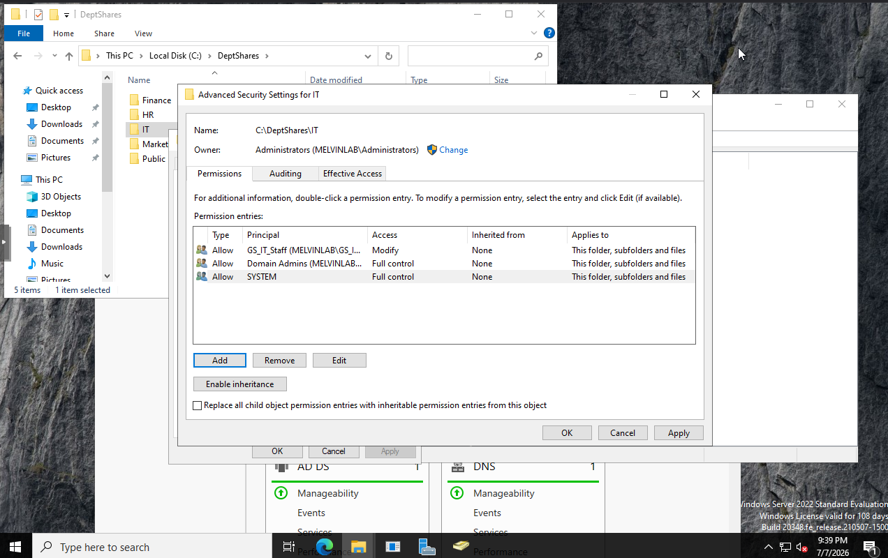

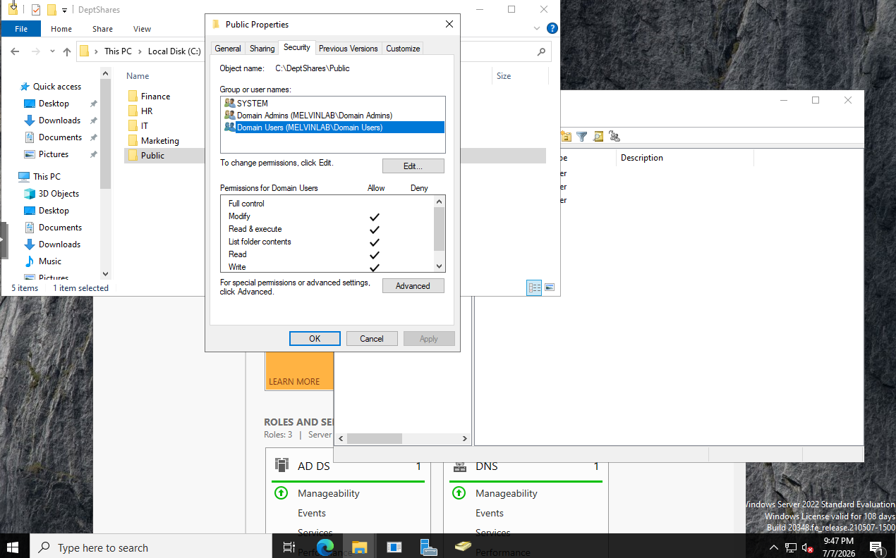

---

### Phase 5: Step 3 – GPO Drive Mapping & Automated Network Share Deployment
With shares secured at the NTFS level, the final step was eliminating manual drive mapping entirely. In an enterprise environment, users should never have to map their own drives — the infrastructure handles it automatically at login.

I created a new Group Policy Object called Dept Drive Mapping and linked it to the MelvinLab_users OU so it applies to all domain users. Inside the GPO, I navigated to User Configuration → Preferences → Windows Settings → Drive Maps and created five separate drive mapping entries — one per department share and one for Public.

For each department share (IT, HR, Finance, Marketing), I configured the action as Create, pointed the location to the corresponding UNC path on MEL-DC-01, and assigned drive letter H:. The key to making this work without conflict is Item-Level Targeting — each mapping is filtered to its specific security group. An IT user gets the IT share on H:, an HR user gets the HR share on H:, and so on. Because only one mapping ever applies per user, there is no collision on the drive letter.

The Public share was handled differently. Since every domain user belongs to Domain Users by default, no targeting was needed — but it required a different drive letter. I assigned it Z: to avoid conflicting with the department H: mapping that every user also receives. I also enabled Run in logged-on user's security context on the Common tab for all five entries, which ensures the mapping executes under the user's own credentials rather than the computer account.

After running gpupdate /force on MEL-CL-01 and signing out and back in, both mapped drives appeared automatically in File Explorer — H: for the user's department share and Z: for Public — with no manual configuration required on the client side.

**Screenshots:**

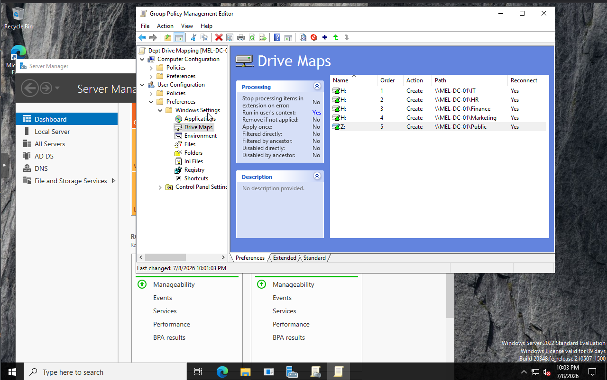

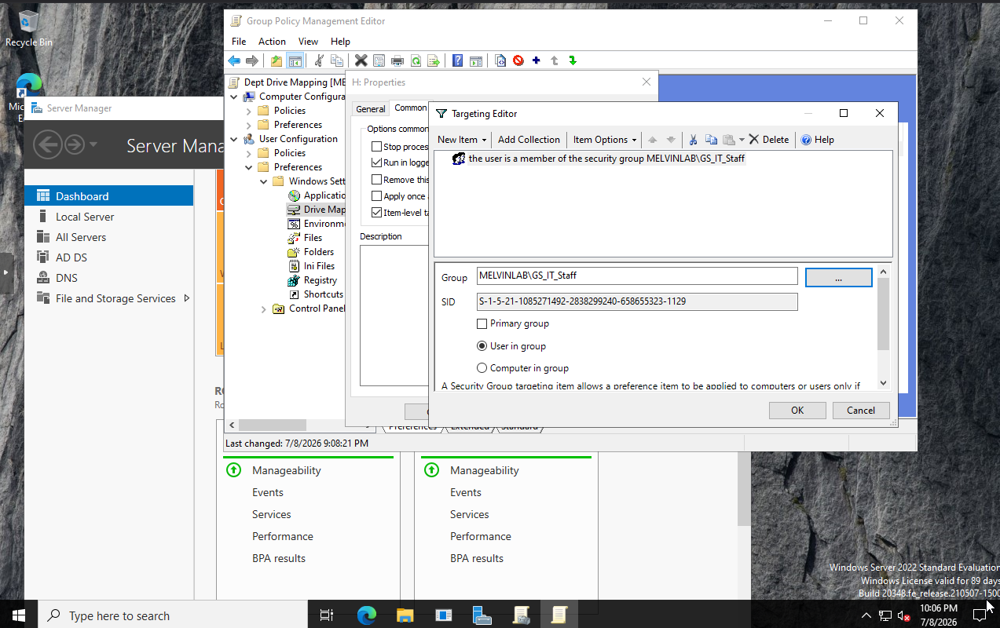

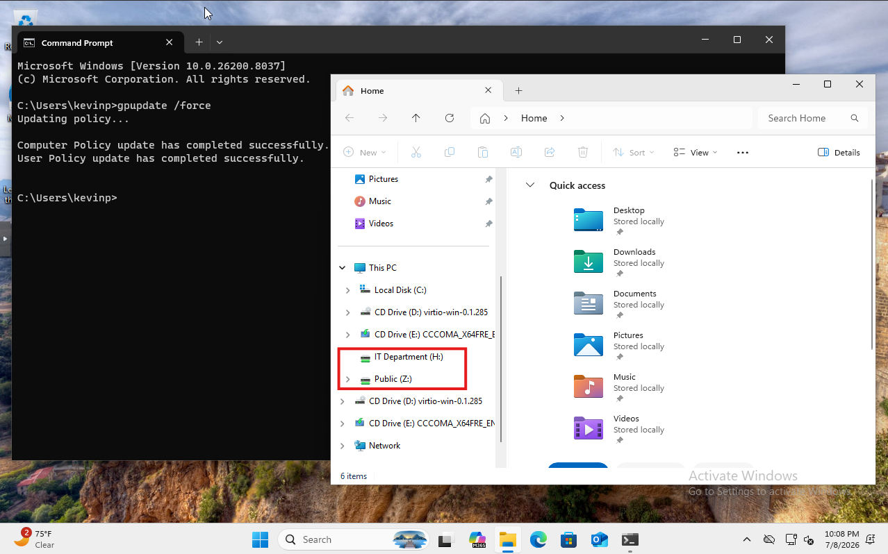
