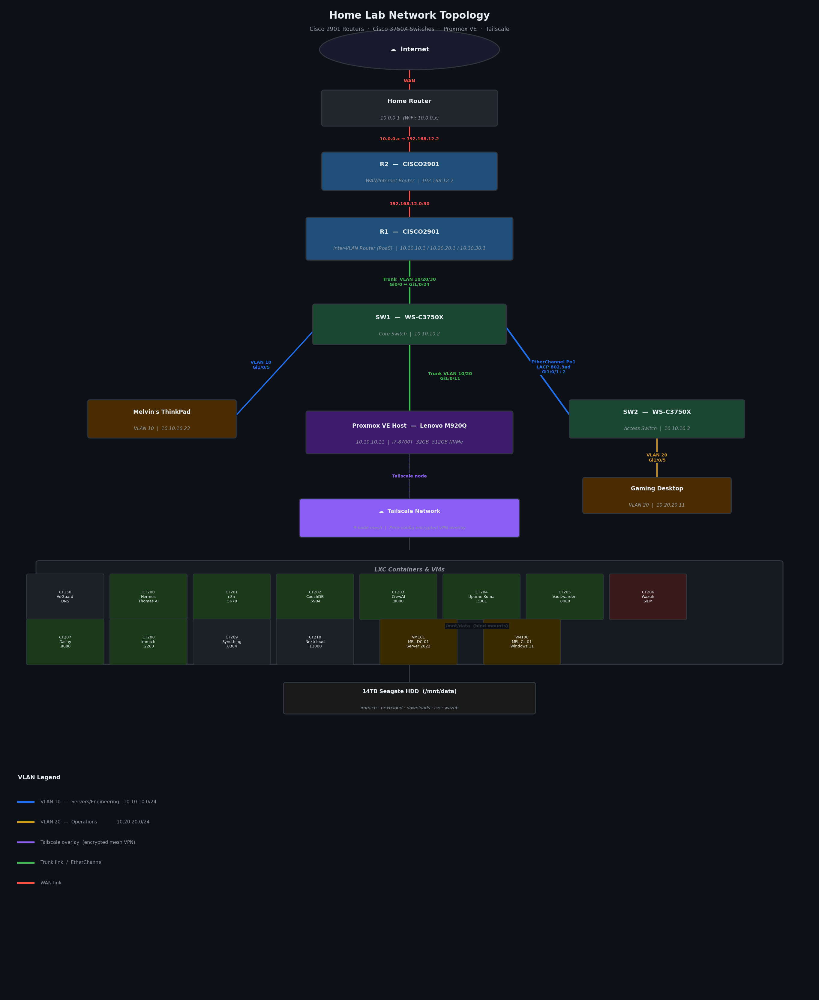

# Physical Cisco Network & Proxmox Homelab

**Enterprise-grade home lab built on real Cisco hardware and a Proxmox VE hypervisor — fully segmented, remotely accessible, and production-style in every way.**

---

## Network Topology

---

## Physical Network

### Hardware

| Device | Model | Role |
|--------|-------|------|
| R1 | Cisco 2901 | Inter-VLAN router (router-on-a-stick), OSPF |
| R2 | Cisco 2901 | WAN/internet uplink router |
| SW1 | Cisco 3750X | Core switch — uplink to R1, trunk to PVE and SW2 |
| SW2 | Cisco 3750X | Access switch — VLAN 20 endpoints |

### VLAN Segmentation

| VLAN | Name | Subnet | Purpose |
|------|------|--------|---------|
| 10 | Servers / Engineering | 10.10.10.0/24 | Proxmox host, lab infrastructure |
| 20 | Operations | 10.20.20.0/24 | End-user devices |
| 30 | Servers_Media | 10.30.30.0/24 | Reserved media tier |
| 999 | BlackHole | — | Unused port isolation |

### Routing & Switching Features

- **Inter-VLAN routing** via router-on-a-stick (R1 Gi0/0 subinterfaces per VLAN)
- **OSPF** — Process 1, Area 0, Router-ID 1.1.1.1, advertising all three VLAN subnets and WAN link
- **EtherChannel** — LACP 802.3ad Port-Channel 1 between SW1 and SW2 (Gi1/0/1 + Gi1/0/2) for redundancy and throughput
- **802.1Q trunking** — R1↔SW1 and SW1↔PVE host carry all VLANs
- **ACLs** — Standard ACL 1 (NAT overload for Proxmox subnet), Extended ACL 101 (directed-broadcast filter on VLAN 20)

---

## Proxmox VE Hypervisor

**Hardware:** Lenovo ThinkCentre M920Q · Intel i7-8700T · 32GB RAM · 512GB NVMe · 14TB Seagate HDD

**OS:** Proxmox VE 9.1.0

### Network Bridges

| Bridge | Subnet | Role |
|--------|--------|------|
| vmbr0 | 10.10.10.0/24 | Physical VLAN trunk — all internet-facing containers |
| vmbr1 | 10.40.40.0/24 | Internal NAT bridge — private services, no direct WAN exposure |

### Containers & VMs

| ID | Name | IP | Purpose |
|----|------|----|---------|
| CT150 | adguard-home | 10.10.10.50 | Network-wide DNS adblocker + MagicDNS |
| CT200 | hermes-core | 10.10.10.62 | Thomas AI agent + Ollama (mistral) |
| CT201 | n8n | 10.40.40.2 | Workflow automation |
| CT202 | couchdb | 10.40.40.3 | Obsidian LiveSync backend |
| CT203 | crewai | 10.40.40.5 | CrewAI multi-agent framework |
| CT204 | uptime-kuma | 10.40.40.4 | Uptime monitoring |
| CT205 | vaultwarden | 10.40.40.6 | Self-hosted password manager |
| CT206 | wazuh | 10.40.40.7 | SIEM — 7 agents across all hosts |
| CT207 | dashy | 10.40.40.8 | Command-center dashboard |
| CT208 | immich | 10.10.10.33 | Photo management (Docker) |
| CT209 | syncthing | 10.10.10.34 | Peer-to-peer file sync |
| CT210 | nextcloud | 10.10.10.35 | Cloud storage (Nextcloud AIO) |
| VM101 | MEL-DC-01 | — | Windows Server 2022 Domain Controller |
| VM108 | MEL-CL-01 | — | Windows 11 domain client |

### Cross-Subnet Routing

Internal containers on vmbr1 (10.40.40.0/24) reach vmbr0 (10.10.10.0/24) via:
- `net.ipv4.ip_forward=1` on PVE host
- Static routes on all vmbr0 containers pointing `10.40.40.0/24 via 10.10.10.11`
- `iptables FORWARD ACCEPT` between bridges

---

## Remote Access & Services

### Tailscale Mesh VPN

9-node WireGuard-based mesh — all lab nodes, mobile devices, and the PVE host are accessible from anywhere without port forwarding. The PVE node runs as a Tailscale exit node and exposes services via **Tailscale Funnel** (public HTTPS).

### Caddy Reverse Proxy

Running on the PVE host — handles TLS termination and routes traffic to internal services via both path-based and port-based routing. All arr-stack services require `X-Forwarded-Proto` headers to prevent HTTPS redirect loops behind the proxy.

### Wazuh SIEM

Wazuh v4.14.5 deployed in CT206 with agents on 7 hosts: hermes-core, couchdb, vaultwarden, crewai, n8n, uptime-kuma, and the PVE host itself. Provides centralized log aggregation, file integrity monitoring, and alerting.

---

## Skills Demonstrated

`Cisco IOS` `VLANs` `OSPF` `EtherChannel / LACP` `ACLs` `NAT` `802.1Q Trunking` `Proxmox VE` `LXC Containers` `Linux Networking` `Tailscale` `WireGuard` `Caddy` `Wazuh SIEM` `Docker` `DNS` `Reverse Proxy`
