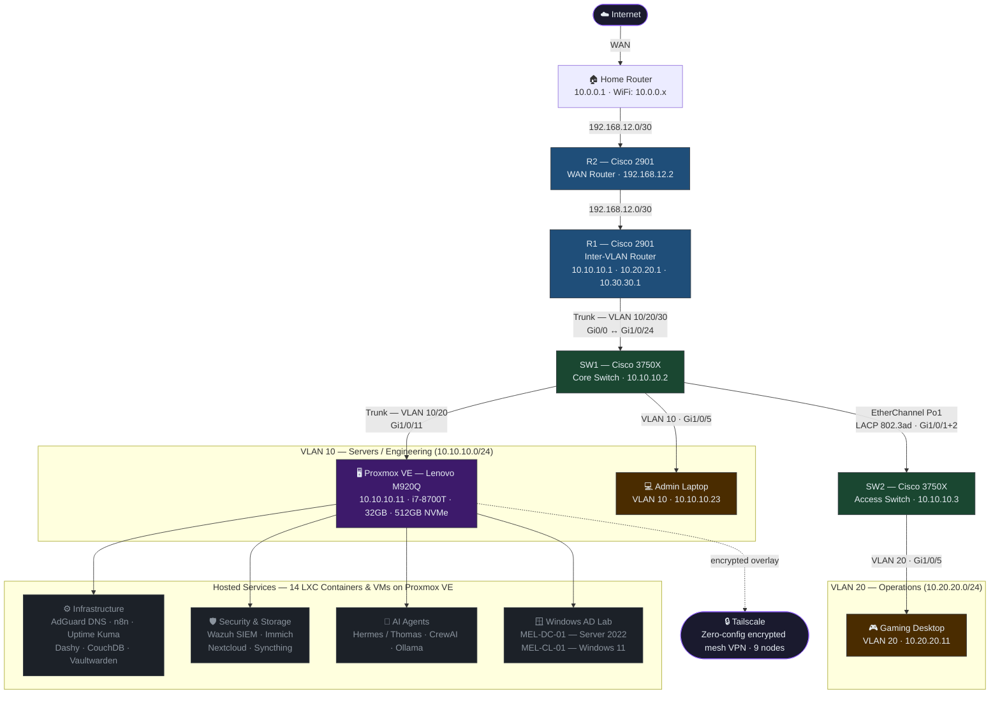

```mermaid
graph TD
    INET(["☁️ Internet"])
    HR["🏠 Home Router\n10.0.0.1 · WiFi: 10.0.0.x"]
    R2["R2 — Cisco 2901\nWAN Router · 192.168.12.2"]
    R1["R1 — Cisco 2901\nInter-VLAN Router\n10.10.10.1 · 10.20.20.1 · 10.30.30.1"]
    SW1["SW1 — Cisco 3750X\nCore Switch · 10.10.10.2"]
    SW2["SW2 — Cisco 3750X\nAccess Switch · 10.10.10.3"]
    PVE["🖥️ Proxmox VE — Lenovo M920Q\n10.10.10.11 · i7-8700T · 32GB · 512GB NVMe"]
    LP["💻 Admin Laptop\nVLAN 10 · 10.10.10.23"]
    GD["🎮 Gaming Desktop\nVLAN 20 · 10.20.20.11"]
    TS(["🔒 Tailscale\nZero-config encrypted mesh VPN · 9 nodes"])

    INET -->|WAN| HR
    HR -->|"192.168.12.0/30"| R2
    R2 -->|"192.168.12.0/30"| R1
    R1 -->|"Trunk — VLAN 10/20/30\nGi0/0 ↔ Gi1/0/24"| SW1
    SW1 -->|"Trunk — VLAN 10/20\nGi1/0/11"| PVE
    SW1 -->|"VLAN 10 · Gi1/0/5"| LP
    SW1 -->|"EtherChannel Po1\nLACP 802.3ad · Gi1/0/1+2"| SW2
    SW2 -->|"VLAN 20 · Gi1/0/5"| GD
    PVE -. "encrypted overlay" .-> TS

    subgraph VLAN10["VLAN 10 — Servers / Engineering  (10.10.10.0/24)"]
        PVE
        LP
    end

    subgraph VLAN20["VLAN 20 — Operations  (10.20.20.0/24)"]
        GD
    end

    subgraph SVC["Hosted Services — 14 LXC Containers & VMs on Proxmox VE"]
        direction LR
        INFRA["⚙️ Infrastructure\nAdGuard DNS · n8n · Uptime Kuma\nDashy · CouchDB · Vaultwarden"]
        SEC["🛡️ Security & Storage\nWazuh SIEM · Immich\nNextcloud · Syncthing"]
        AI["🤖 AI Agents\nHermes / Thomas · CrewAI · Ollama"]
        WIN["🪟 Windows AD Lab\nMEL-DC-01 — Server 2022\nMEL-CL-01 — Windows 11"]
    end

    PVE --> INFRA
    PVE --> SEC
    PVE --> AI
    PVE --> WIN

    classDef router fill:#1f4e79,stroke:#30363d,color:#e6edf3
    classDef switch fill:#1a4731,stroke:#30363d,color:#e6edf3
    classDef host   fill:#3d1a6b,stroke:#30363d,color:#e6edf3
    classDef device fill:#4a2c00,stroke:#30363d,color:#e6edf3
    classDef cloud  fill:#1a1a2e,stroke:#8b5cf6,color:#e6edf3
    classDef svc    fill:#1c2128,stroke:#30363d,color:#8b949e

    class R1,R2 router
    class SW1,SW2 switch
    class PVE host
    class LP,GD device
    class INET,TS cloud
    class MEDIA,INFRA,SEC,AI,WIN svc
```
